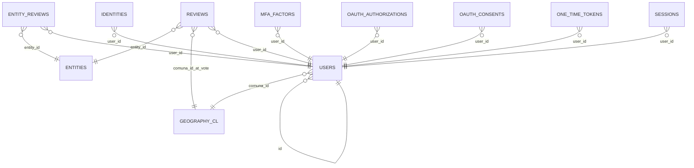

> ⚠️ DESACTUALIZADO [2026-04-07]. Generado 2026-03-11, anterior a migraciones backend 014-018 y supabase 003-010.
> Falta documentar: polls, versus, events, poll_votes, versus_votes, event_participants, event_votes, geography_cl.
> Para regenerar: ejecutar `backend/scripts/fetch_db_schema.py` con conexión a DB de producción.

# Esquema de Base de Datos — BEACON Protocol

> **Generado:** 2026-03-11 19:30:17 UTC
> **Script:** `backend/scripts/fetch_db_schema.py`
> **Estado:** ⚠️ DESACTUALIZADO — Ver estructura actual en docs/PROJECT_OVERVIEW.md  

## Extensiones PostgreSQL

| Extensión | Versión | Descripción |
|-----------|---------|-------------|
| `pg_graphql` | 1.5.11 | pg_graphql: GraphQL support |
| `pg_stat_statements` | 1.11 | track planning and execution statistics of all SQL statements executed |
| `pgcrypto` | 1.3 | cryptographic functions |
| `plpgsql` | 1.0 | PL/pgSQL procedural language |
| `supabase_vault` | 0.3.1 | Supabase Vault Extension |
| `uuid-ossp` | 1.1 | generate universally unique identifiers (UUIDs) |

## Tipos ENUM

### `auth.aal_level`
Valores: `aal1`, `aal2`, `aal3`

### `auth.code_challenge_method`
Valores: `s256`, `plain`

### `auth.factor_status`
Valores: `unverified`, `verified`

### `auth.factor_type`
Valores: `totp`, `webauthn`, `phone`

### `auth.oauth_authorization_status`
Valores: `pending`, `approved`, `denied`, `expired`

### `auth.oauth_client_type`
Valores: `public`, `confidential`

### `auth.oauth_registration_type`
Valores: `dynamic`, `manual`

### `auth.oauth_response_type`
Valores: `code`

### `auth.one_time_token_type`
Valores: `confirmation_token`, `reauthentication_token`, `recovery_token`, `email_change_token_new`, `email_change_token_current`, `phone_change_token`

### `public.user_role`
Valores: `user`, `moderator`, `admin`

### `realtime.action`
Valores: `INSERT`, `UPDATE`, `DELETE`, `TRUNCATE`, `ERROR`

### `realtime.equality_op`
Valores: `eq`, `neq`, `lt`, `lte`, `gt`, `gte`, `in`

### `storage.buckettype`
Valores: `STANDARD`, `ANALYTICS`, `VECTOR`

---

## Schema `auth`

### Tabla: `auth.audit_log_entries`

_Auth: Audit trail for user actions._

#### Columnas

| # | Columna | Tipo | Nullable | Default | Comentario |
|---|---------|------|----------|---------|------------|
| 1 | `instance_id` | `UUID` | NULL | `` |  |
| 2 | `id` | `UUID` | NOT NULL | `` |  |
| 3 | `payload` | `JSON` | NULL | `` |  |
| 4 | `created_at` | `TIMESTAMP WITH TIME ZONE` | NULL | `` |  |
| 5 | `ip_address` | `VARCHAR(64)` | NOT NULL | `''::character varying` |  |

#### Constraints

| Tipo | Nombre | Columnas | Referencias |
|------|--------|----------|-------------|
| CHECK | `16494_16525_2_not_null` | `None` |  |
| CHECK | `16494_16525_5_not_null` | `None` |  |
| PRIMARY KEY | `audit_log_entries_pkey` | `id` |  |

#### Índices

| Nombre | Definición |
|--------|------------|
| `audit_log_entries_pkey` | `CREATE UNIQUE INDEX audit_log_entries_pkey ON auth.audit_log_entries USING btree (id)` |
| `audit_logs_instance_id_idx` | `CREATE INDEX audit_logs_instance_id_idx ON auth.audit_log_entries USING btree (instance_id)` |

### Tabla: `auth.custom_oauth_providers`

#### Columnas

| # | Columna | Tipo | Nullable | Default | Comentario |
|---|---------|------|----------|---------|------------|
| 1 | `id` | `UUID` | NOT NULL | `gen_random_uuid()` |  |
| 2 | `provider_type` | `TEXT` | NOT NULL | `` |  |
| 3 | `identifier` | `TEXT` | NOT NULL | `` |  |
| 4 | `name` | `TEXT` | NOT NULL | `` |  |
| 5 | `client_id` | `TEXT` | NOT NULL | `` |  |
| 6 | `client_secret` | `TEXT` | NOT NULL | `` |  |
| 7 | `acceptable_client_ids` | `ARRAY` | NOT NULL | `'{}'::text[]` |  |
| 8 | `scopes` | `ARRAY` | NOT NULL | `'{}'::text[]` |  |
| 9 | `pkce_enabled` | `BOOLEAN` | NOT NULL | `true` |  |
| 10 | `attribute_mapping` | `JSONB` | NOT NULL | `'{}'::jsonb` |  |
| 11 | `authorization_params` | `JSONB` | NOT NULL | `'{}'::jsonb` |  |
| 12 | `enabled` | `BOOLEAN` | NOT NULL | `true` |  |
| 13 | `email_optional` | `BOOLEAN` | NOT NULL | `false` |  |
| 14 | `issuer` | `TEXT` | NULL | `` |  |
| 15 | `discovery_url` | `TEXT` | NULL | `` |  |
| 16 | `skip_nonce_check` | `BOOLEAN` | NOT NULL | `false` |  |
| 17 | `cached_discovery` | `JSONB` | NULL | `` |  |
| 18 | `discovery_cached_at` | `TIMESTAMP WITH TIME ZONE` | NULL | `` |  |
| 19 | `authorization_url` | `TEXT` | NULL | `` |  |
| 20 | `token_url` | `TEXT` | NULL | `` |  |
| 21 | `userinfo_url` | `TEXT` | NULL | `` |  |
| 22 | `jwks_uri` | `TEXT` | NULL | `` |  |
| 23 | `created_at` | `TIMESTAMP WITH TIME ZONE` | NOT NULL | `now()` |  |
| 24 | `updated_at` | `TIMESTAMP WITH TIME ZONE` | NOT NULL | `now()` |  |

#### Constraints

| Tipo | Nombre | Columnas | Referencias |
|------|--------|----------|-------------|
| CHECK | `16494_18686_10_not_null` | `None` |  |
| CHECK | `16494_18686_11_not_null` | `None` |  |
| CHECK | `16494_18686_12_not_null` | `None` |  |
| CHECK | `16494_18686_13_not_null` | `None` |  |
| CHECK | `16494_18686_16_not_null` | `None` |  |
| CHECK | `16494_18686_1_not_null` | `None` |  |
| CHECK | `16494_18686_23_not_null` | `None` |  |
| CHECK | `16494_18686_24_not_null` | `None` |  |
| CHECK | `16494_18686_2_not_null` | `None` |  |
| CHECK | `16494_18686_3_not_null` | `None` |  |
| CHECK | `16494_18686_4_not_null` | `None` |  |
| CHECK | `16494_18686_5_not_null` | `None` |  |
| CHECK | `16494_18686_6_not_null` | `None` |  |
| CHECK | `16494_18686_7_not_null` | `None` |  |
| CHECK | `16494_18686_8_not_null` | `None` |  |
| CHECK | `16494_18686_9_not_null` | `None` |  |
| CHECK | `custom_oauth_providers_authorization_url_https` | `None` |  |
| CHECK | `custom_oauth_providers_authorization_url_length` | `None` |  |
| CHECK | `custom_oauth_providers_client_id_length` | `None` |  |
| CHECK | `custom_oauth_providers_discovery_url_length` | `None` |  |
| CHECK | `custom_oauth_providers_identifier_format` | `None` |  |
| CHECK | `custom_oauth_providers_issuer_length` | `None` |  |
| CHECK | `custom_oauth_providers_jwks_uri_https` | `None` |  |
| CHECK | `custom_oauth_providers_jwks_uri_length` | `None` |  |
| CHECK | `custom_oauth_providers_name_length` | `None` |  |
| CHECK | `custom_oauth_providers_oauth2_requires_endpoints` | `None` |  |
| CHECK | `custom_oauth_providers_oidc_discovery_url_https` | `None` |  |
| CHECK | `custom_oauth_providers_oidc_issuer_https` | `None` |  |
| CHECK | `custom_oauth_providers_oidc_requires_issuer` | `None` |  |
| CHECK | `custom_oauth_providers_provider_type_check` | `None` |  |
| CHECK | `custom_oauth_providers_token_url_https` | `None` |  |
| CHECK | `custom_oauth_providers_token_url_length` | `None` |  |
| CHECK | `custom_oauth_providers_userinfo_url_https` | `None` |  |
| CHECK | `custom_oauth_providers_userinfo_url_length` | `None` |  |
| PRIMARY KEY | `custom_oauth_providers_pkey` | `id` |  |
| UNIQUE | `custom_oauth_providers_identifier_key` | `identifier` |  |

#### Índices

| Nombre | Definición |
|--------|------------|
| `custom_oauth_providers_created_at_idx` | `CREATE INDEX custom_oauth_providers_created_at_idx ON auth.custom_oauth_providers USING btree (created_at)` |
| `custom_oauth_providers_enabled_idx` | `CREATE INDEX custom_oauth_providers_enabled_idx ON auth.custom_oauth_providers USING btree (enabled)` |
| `custom_oauth_providers_identifier_idx` | `CREATE INDEX custom_oauth_providers_identifier_idx ON auth.custom_oauth_providers USING btree (identifier)` |
| `custom_oauth_providers_identifier_key` | `CREATE UNIQUE INDEX custom_oauth_providers_identifier_key ON auth.custom_oauth_providers USING btree (identifier)` |
| `custom_oauth_providers_pkey` | `CREATE UNIQUE INDEX custom_oauth_providers_pkey ON auth.custom_oauth_providers USING btree (id)` |
| `custom_oauth_providers_provider_type_idx` | `CREATE INDEX custom_oauth_providers_provider_type_idx ON auth.custom_oauth_providers USING btree (provider_type)` |

### Tabla: `auth.flow_state`

_Stores metadata for all OAuth/SSO login flows_

#### Columnas

| # | Columna | Tipo | Nullable | Default | Comentario |
|---|---------|------|----------|---------|------------|
| 1 | `id` | `UUID` | NOT NULL | `` |  |
| 2 | `user_id` | `UUID` | NULL | `` |  |
| 3 | `auth_code` | `TEXT` | NULL | `` |  |
| 4 | `code_challenge_method` | `CODE_CHALLENGE_METHOD` | NULL | `` |  |
| 5 | `code_challenge` | `TEXT` | NULL | `` |  |
| 6 | `provider_type` | `TEXT` | NOT NULL | `` |  |
| 7 | `provider_access_token` | `TEXT` | NULL | `` |  |
| 8 | `provider_refresh_token` | `TEXT` | NULL | `` |  |
| 9 | `created_at` | `TIMESTAMP WITH TIME ZONE` | NULL | `` |  |
| 10 | `updated_at` | `TIMESTAMP WITH TIME ZONE` | NULL | `` |  |
| 11 | `authentication_method` | `TEXT` | NOT NULL | `` |  |
| 12 | `auth_code_issued_at` | `TIMESTAMP WITH TIME ZONE` | NULL | `` |  |
| 13 | `invite_token` | `TEXT` | NULL | `` |  |
| 14 | `referrer` | `TEXT` | NULL | `` |  |
| 15 | `oauth_client_state_id` | `UUID` | NULL | `` |  |
| 16 | `linking_target_id` | `UUID` | NULL | `` |  |
| 17 | `email_optional` | `BOOLEAN` | NOT NULL | `false` |  |

#### Constraints

| Tipo | Nombre | Columnas | Referencias |
|------|--------|----------|-------------|
| CHECK | `16494_16883_11_not_null` | `None` |  |
| CHECK | `16494_16883_17_not_null` | `None` |  |
| CHECK | `16494_16883_1_not_null` | `None` |  |
| CHECK | `16494_16883_6_not_null` | `None` |  |
| PRIMARY KEY | `flow_state_pkey` | `id` |  |

#### Índices

| Nombre | Definición |
|--------|------------|
| `flow_state_created_at_idx` | `CREATE INDEX flow_state_created_at_idx ON auth.flow_state USING btree (created_at DESC)` |
| `flow_state_pkey` | `CREATE UNIQUE INDEX flow_state_pkey ON auth.flow_state USING btree (id)` |
| `idx_auth_code` | `CREATE INDEX idx_auth_code ON auth.flow_state USING btree (auth_code)` |
| `idx_user_id_auth_method` | `CREATE INDEX idx_user_id_auth_method ON auth.flow_state USING btree (user_id, authentication_method)` |

### Tabla: `auth.identities`

_Auth: Stores identities associated to a user._

#### Columnas

| # | Columna | Tipo | Nullable | Default | Comentario |
|---|---------|------|----------|---------|------------|
| 1 | `provider_id` | `TEXT` | NOT NULL | `` |  |
| 2 | `user_id` | `UUID` | NOT NULL | `` |  |
| 3 | `identity_data` | `JSONB` | NOT NULL | `` |  |
| 4 | `provider` | `TEXT` | NOT NULL | `` |  |
| 5 | `last_sign_in_at` | `TIMESTAMP WITH TIME ZONE` | NULL | `` |  |
| 6 | `created_at` | `TIMESTAMP WITH TIME ZONE` | NULL | `` |  |
| 7 | `updated_at` | `TIMESTAMP WITH TIME ZONE` | NULL | `` |  |
| 8 | `email` | `TEXT` | NULL | `` | Auth: Email is a generated column that references the option |
| 9 | `id` | `UUID` | NOT NULL | `gen_random_uuid()` |  |

#### Constraints

| Tipo | Nombre | Columnas | Referencias |
|------|--------|----------|-------------|
| CHECK | `16494_16681_1_not_null` | `None` |  |
| CHECK | `16494_16681_2_not_null` | `None` |  |
| CHECK | `16494_16681_3_not_null` | `None` |  |
| CHECK | `16494_16681_4_not_null` | `None` |  |
| CHECK | `16494_16681_9_not_null` | `None` |  |
| FOREIGN KEY | `identities_user_id_fkey` | `user_id` | `public.users(id)` ON DELETE CASCADE |
| PRIMARY KEY | `identities_pkey` | `id` |  |
| UNIQUE | `identities_provider_id_provider_unique` | `provider_id, provider` |  |

#### Índices

| Nombre | Definición |
|--------|------------|
| `identities_email_idx` | `CREATE INDEX identities_email_idx ON auth.identities USING btree (email text_pattern_ops)` |
| `identities_pkey` | `CREATE UNIQUE INDEX identities_pkey ON auth.identities USING btree (id)` |
| `identities_provider_id_provider_unique` | `CREATE UNIQUE INDEX identities_provider_id_provider_unique ON auth.identities USING btree (provider_id, provider)` |
| `identities_user_id_idx` | `CREATE INDEX identities_user_id_idx ON auth.identities USING btree (user_id)` |

### Tabla: `auth.instances`

_Auth: Manages users across multiple sites._

#### Columnas

| # | Columna | Tipo | Nullable | Default | Comentario |
|---|---------|------|----------|---------|------------|
| 1 | `id` | `UUID` | NOT NULL | `` |  |
| 2 | `uuid` | `UUID` | NULL | `` |  |
| 3 | `raw_base_config` | `TEXT` | NULL | `` |  |
| 4 | `created_at` | `TIMESTAMP WITH TIME ZONE` | NULL | `` |  |
| 5 | `updated_at` | `TIMESTAMP WITH TIME ZONE` | NULL | `` |  |

#### Constraints

| Tipo | Nombre | Columnas | Referencias |
|------|--------|----------|-------------|
| CHECK | `16494_16518_1_not_null` | `None` |  |
| PRIMARY KEY | `instances_pkey` | `id` |  |

#### Índices

| Nombre | Definición |
|--------|------------|
| `instances_pkey` | `CREATE UNIQUE INDEX instances_pkey ON auth.instances USING btree (id)` |

### Tabla: `auth.mfa_amr_claims`

_auth: stores authenticator method reference claims for multi factor authentication_

#### Columnas

| # | Columna | Tipo | Nullable | Default | Comentario |
|---|---------|------|----------|---------|------------|
| 1 | `session_id` | `UUID` | NOT NULL | `` |  |
| 2 | `created_at` | `TIMESTAMP WITH TIME ZONE` | NOT NULL | `` |  |
| 3 | `updated_at` | `TIMESTAMP WITH TIME ZONE` | NOT NULL | `` |  |
| 4 | `authentication_method` | `TEXT` | NOT NULL | `` |  |
| 5 | `id` | `UUID` | NOT NULL | `` |  |

#### Constraints

| Tipo | Nombre | Columnas | Referencias |
|------|--------|----------|-------------|
| CHECK | `16494_16770_1_not_null` | `None` |  |
| CHECK | `16494_16770_2_not_null` | `None` |  |
| CHECK | `16494_16770_3_not_null` | `None` |  |
| CHECK | `16494_16770_4_not_null` | `None` |  |
| CHECK | `16494_16770_5_not_null` | `None` |  |
| FOREIGN KEY | `mfa_amr_claims_session_id_fkey` | `session_id` |  |
| PRIMARY KEY | `amr_id_pk` | `id` |  |
| UNIQUE | `mfa_amr_claims_session_id_authentication_method_pkey` | `session_id, authentication_method` |  |

#### Índices

| Nombre | Definición |
|--------|------------|
| `amr_id_pk` | `CREATE UNIQUE INDEX amr_id_pk ON auth.mfa_amr_claims USING btree (id)` |
| `mfa_amr_claims_session_id_authentication_method_pkey` | `CREATE UNIQUE INDEX mfa_amr_claims_session_id_authentication_method_pkey ON auth.mfa_amr_claims USING btree (session_id, authentication_method)` |

### Tabla: `auth.mfa_challenges`

_auth: stores metadata about challenge requests made_

#### Columnas

| # | Columna | Tipo | Nullable | Default | Comentario |
|---|---------|------|----------|---------|------------|
| 1 | `id` | `UUID` | NOT NULL | `` |  |
| 2 | `factor_id` | `UUID` | NOT NULL | `` |  |
| 3 | `created_at` | `TIMESTAMP WITH TIME ZONE` | NOT NULL | `` |  |
| 4 | `verified_at` | `TIMESTAMP WITH TIME ZONE` | NULL | `` |  |
| 5 | `ip_address` | `INET` | NOT NULL | `` |  |
| 6 | `otp_code` | `TEXT` | NULL | `` |  |
| 7 | `web_authn_session_data` | `JSONB` | NULL | `` |  |

#### Constraints

| Tipo | Nombre | Columnas | Referencias |
|------|--------|----------|-------------|
| CHECK | `16494_16758_1_not_null` | `None` |  |
| CHECK | `16494_16758_2_not_null` | `None` |  |
| CHECK | `16494_16758_3_not_null` | `None` |  |
| CHECK | `16494_16758_5_not_null` | `None` |  |
| FOREIGN KEY | `mfa_challenges_auth_factor_id_fkey` | `factor_id` |  |
| PRIMARY KEY | `mfa_challenges_pkey` | `id` |  |

#### Índices

| Nombre | Definición |
|--------|------------|
| `mfa_challenge_created_at_idx` | `CREATE INDEX mfa_challenge_created_at_idx ON auth.mfa_challenges USING btree (created_at DESC)` |
| `mfa_challenges_pkey` | `CREATE UNIQUE INDEX mfa_challenges_pkey ON auth.mfa_challenges USING btree (id)` |

### Tabla: `auth.mfa_factors`

_auth: stores metadata about factors_

#### Columnas

| # | Columna | Tipo | Nullable | Default | Comentario |
|---|---------|------|----------|---------|------------|
| 1 | `id` | `UUID` | NOT NULL | `` |  |
| 2 | `user_id` | `UUID` | NOT NULL | `` |  |
| 3 | `friendly_name` | `TEXT` | NULL | `` |  |
| 4 | `factor_type` | `FACTOR_TYPE` | NOT NULL | `` |  |
| 5 | `status` | `FACTOR_STATUS` | NOT NULL | `` |  |
| 6 | `created_at` | `TIMESTAMP WITH TIME ZONE` | NOT NULL | `` |  |
| 7 | `updated_at` | `TIMESTAMP WITH TIME ZONE` | NOT NULL | `` |  |
| 8 | `secret` | `TEXT` | NULL | `` |  |
| 9 | `phone` | `TEXT` | NULL | `` |  |
| 10 | `last_challenged_at` | `TIMESTAMP WITH TIME ZONE` | NULL | `` |  |
| 11 | `web_authn_credential` | `JSONB` | NULL | `` |  |
| 12 | `web_authn_aaguid` | `UUID` | NULL | `` |  |
| 13 | `last_webauthn_challenge_data` | `JSONB` | NULL | `` | Stores the latest WebAuthn challenge data including attestat |

#### Constraints

| Tipo | Nombre | Columnas | Referencias |
|------|--------|----------|-------------|
| CHECK | `16494_16745_1_not_null` | `None` |  |
| CHECK | `16494_16745_2_not_null` | `None` |  |
| CHECK | `16494_16745_4_not_null` | `None` |  |
| CHECK | `16494_16745_5_not_null` | `None` |  |
| CHECK | `16494_16745_6_not_null` | `None` |  |
| CHECK | `16494_16745_7_not_null` | `None` |  |
| FOREIGN KEY | `mfa_factors_user_id_fkey` | `user_id` | `public.users(id)` ON DELETE CASCADE |
| PRIMARY KEY | `mfa_factors_pkey` | `id` |  |
| UNIQUE | `mfa_factors_last_challenged_at_key` | `last_challenged_at` |  |

#### Índices

| Nombre | Definición |
|--------|------------|
| `factor_id_created_at_idx` | `CREATE INDEX factor_id_created_at_idx ON auth.mfa_factors USING btree (user_id, created_at)` |
| `mfa_factors_last_challenged_at_key` | `CREATE UNIQUE INDEX mfa_factors_last_challenged_at_key ON auth.mfa_factors USING btree (last_challenged_at)` |
| `mfa_factors_pkey` | `CREATE UNIQUE INDEX mfa_factors_pkey ON auth.mfa_factors USING btree (id)` |
| `mfa_factors_user_friendly_name_unique` | `CREATE UNIQUE INDEX mfa_factors_user_friendly_name_unique ON auth.mfa_factors USING btree (friendly_name, user_id) WHERE (TRIM(BOTH FROM friendly_name) <> ''::text)` |
| `mfa_factors_user_id_idx` | `CREATE INDEX mfa_factors_user_id_idx ON auth.mfa_factors USING btree (user_id)` |
| `unique_phone_factor_per_user` | `CREATE UNIQUE INDEX unique_phone_factor_per_user ON auth.mfa_factors USING btree (user_id, phone)` |

### Tabla: `auth.oauth_authorizations`

#### Columnas

| # | Columna | Tipo | Nullable | Default | Comentario |
|---|---------|------|----------|---------|------------|
| 1 | `id` | `UUID` | NOT NULL | `` |  |
| 2 | `authorization_id` | `TEXT` | NOT NULL | `` |  |
| 3 | `client_id` | `UUID` | NOT NULL | `` |  |
| 4 | `user_id` | `UUID` | NULL | `` |  |
| 5 | `redirect_uri` | `TEXT` | NOT NULL | `` |  |
| 6 | `scope` | `TEXT` | NOT NULL | `` |  |
| 7 | `state` | `TEXT` | NULL | `` |  |
| 8 | `resource` | `TEXT` | NULL | `` |  |
| 9 | `code_challenge` | `TEXT` | NULL | `` |  |
| 10 | `code_challenge_method` | `CODE_CHALLENGE_METHOD` | NULL | `` |  |
| 11 | `response_type` | `OAUTH_RESPONSE_TYPE` | NOT NULL | `'code'::auth.oauth_response_type` |  |
| 12 | `status` | `OAUTH_AUTHORIZATION_STATUS` | NOT NULL | `'pending'::auth.oauth_authorization_s...` |  |
| 13 | `authorization_code` | `TEXT` | NULL | `` |  |
| 14 | `created_at` | `TIMESTAMP WITH TIME ZONE` | NOT NULL | `now()` |  |
| 15 | `expires_at` | `TIMESTAMP WITH TIME ZONE` | NOT NULL | `(now() + '00:03:00'::interval)` |  |
| 16 | `approved_at` | `TIMESTAMP WITH TIME ZONE` | NULL | `` |  |
| 17 | `nonce` | `TEXT` | NULL | `` |  |

#### Constraints

| Tipo | Nombre | Columnas | Referencias |
|------|--------|----------|-------------|
| CHECK | `16494_16995_11_not_null` | `None` |  |
| CHECK | `16494_16995_12_not_null` | `None` |  |
| CHECK | `16494_16995_14_not_null` | `None` |  |
| CHECK | `16494_16995_15_not_null` | `None` |  |
| CHECK | `16494_16995_1_not_null` | `None` |  |
| CHECK | `16494_16995_2_not_null` | `None` |  |
| CHECK | `16494_16995_3_not_null` | `None` |  |
| CHECK | `16494_16995_5_not_null` | `None` |  |
| CHECK | `16494_16995_6_not_null` | `None` |  |
| CHECK | `oauth_authorizations_authorization_code_length` | `None` |  |
| CHECK | `oauth_authorizations_code_challenge_length` | `None` |  |
| CHECK | `oauth_authorizations_expires_at_future` | `None` |  |
| CHECK | `oauth_authorizations_nonce_length` | `None` |  |
| CHECK | `oauth_authorizations_redirect_uri_length` | `None` |  |
| CHECK | `oauth_authorizations_resource_length` | `None` |  |
| CHECK | `oauth_authorizations_scope_length` | `None` |  |
| CHECK | `oauth_authorizations_state_length` | `None` |  |
| FOREIGN KEY | `oauth_authorizations_client_id_fkey` | `client_id` |  |
| FOREIGN KEY | `oauth_authorizations_user_id_fkey` | `user_id` | `public.users(id)` ON DELETE CASCADE |
| PRIMARY KEY | `oauth_authorizations_pkey` | `id` |  |
| UNIQUE | `oauth_authorizations_authorization_code_key` | `authorization_code` |  |
| UNIQUE | `oauth_authorizations_authorization_id_key` | `authorization_id` |  |

#### Índices

| Nombre | Definición |
|--------|------------|
| `oauth_auth_pending_exp_idx` | `CREATE INDEX oauth_auth_pending_exp_idx ON auth.oauth_authorizations USING btree (expires_at) WHERE (status = 'pending'::auth.oauth_authorization_status)` |
| `oauth_authorizations_authorization_code_key` | `CREATE UNIQUE INDEX oauth_authorizations_authorization_code_key ON auth.oauth_authorizations USING btree (authorization_code)` |
| `oauth_authorizations_authorization_id_key` | `CREATE UNIQUE INDEX oauth_authorizations_authorization_id_key ON auth.oauth_authorizations USING btree (authorization_id)` |
| `oauth_authorizations_pkey` | `CREATE UNIQUE INDEX oauth_authorizations_pkey ON auth.oauth_authorizations USING btree (id)` |

### Tabla: `auth.oauth_client_states`

_Stores OAuth states for third-party provider authentication flows where Supabase acts as the OAuth client._

#### Columnas

| # | Columna | Tipo | Nullable | Default | Comentario |
|---|---------|------|----------|---------|------------|
| 1 | `id` | `UUID` | NOT NULL | `` |  |
| 2 | `provider_type` | `TEXT` | NOT NULL | `` |  |
| 3 | `code_verifier` | `TEXT` | NULL | `` |  |
| 4 | `created_at` | `TIMESTAMP WITH TIME ZONE` | NOT NULL | `` |  |

#### Constraints

| Tipo | Nombre | Columnas | Referencias |
|------|--------|----------|-------------|
| CHECK | `16494_17068_1_not_null` | `None` |  |
| CHECK | `16494_17068_2_not_null` | `None` |  |
| CHECK | `16494_17068_4_not_null` | `None` |  |
| PRIMARY KEY | `oauth_client_states_pkey` | `id` |  |

#### Índices

| Nombre | Definición |
|--------|------------|
| `idx_oauth_client_states_created_at` | `CREATE INDEX idx_oauth_client_states_created_at ON auth.oauth_client_states USING btree (created_at)` |
| `oauth_client_states_pkey` | `CREATE UNIQUE INDEX oauth_client_states_pkey ON auth.oauth_client_states USING btree (id)` |

### Tabla: `auth.oauth_clients`

#### Columnas

| # | Columna | Tipo | Nullable | Default | Comentario |
|---|---------|------|----------|---------|------------|
| 1 | `id` | `UUID` | NOT NULL | `` |  |
| 3 | `client_secret_hash` | `TEXT` | NULL | `` |  |
| 4 | `registration_type` | `OAUTH_REGISTRATION_TYPE` | NOT NULL | `` |  |
| 5 | `redirect_uris` | `TEXT` | NOT NULL | `` |  |
| 6 | `grant_types` | `TEXT` | NOT NULL | `` |  |
| 7 | `client_name` | `TEXT` | NULL | `` |  |
| 8 | `client_uri` | `TEXT` | NULL | `` |  |
| 9 | `logo_uri` | `TEXT` | NULL | `` |  |
| 10 | `created_at` | `TIMESTAMP WITH TIME ZONE` | NOT NULL | `now()` |  |
| 11 | `updated_at` | `TIMESTAMP WITH TIME ZONE` | NOT NULL | `now()` |  |
| 12 | `deleted_at` | `TIMESTAMP WITH TIME ZONE` | NULL | `` |  |
| 13 | `client_type` | `OAUTH_CLIENT_TYPE` | NOT NULL | `'confidential'::auth.oauth_client_type` |  |
| 14 | `token_endpoint_auth_method` | `TEXT` | NOT NULL | `` |  |

#### Constraints

| Tipo | Nombre | Columnas | Referencias |
|------|--------|----------|-------------|
| CHECK | `16494_16965_10_not_null` | `None` |  |
| CHECK | `16494_16965_11_not_null` | `None` |  |
| CHECK | `16494_16965_13_not_null` | `None` |  |
| CHECK | `16494_16965_14_not_null` | `None` |  |
| CHECK | `16494_16965_1_not_null` | `None` |  |
| CHECK | `16494_16965_4_not_null` | `None` |  |
| CHECK | `16494_16965_5_not_null` | `None` |  |
| CHECK | `16494_16965_6_not_null` | `None` |  |
| CHECK | `oauth_clients_client_name_length` | `None` |  |
| CHECK | `oauth_clients_client_uri_length` | `None` |  |
| CHECK | `oauth_clients_logo_uri_length` | `None` |  |
| CHECK | `oauth_clients_token_endpoint_auth_method_check` | `None` |  |
| PRIMARY KEY | `oauth_clients_pkey` | `id` |  |

#### Índices

| Nombre | Definición |
|--------|------------|
| `oauth_clients_deleted_at_idx` | `CREATE INDEX oauth_clients_deleted_at_idx ON auth.oauth_clients USING btree (deleted_at)` |
| `oauth_clients_pkey` | `CREATE UNIQUE INDEX oauth_clients_pkey ON auth.oauth_clients USING btree (id)` |

### Tabla: `auth.oauth_consents`

#### Columnas

| # | Columna | Tipo | Nullable | Default | Comentario |
|---|---------|------|----------|---------|------------|
| 1 | `id` | `UUID` | NOT NULL | `` |  |
| 2 | `user_id` | `UUID` | NOT NULL | `` |  |
| 3 | `client_id` | `UUID` | NOT NULL | `` |  |
| 4 | `scopes` | `TEXT` | NOT NULL | `` |  |
| 5 | `granted_at` | `TIMESTAMP WITH TIME ZONE` | NOT NULL | `now()` |  |
| 6 | `revoked_at` | `TIMESTAMP WITH TIME ZONE` | NULL | `` |  |

#### Constraints

| Tipo | Nombre | Columnas | Referencias |
|------|--------|----------|-------------|
| CHECK | `16494_17028_1_not_null` | `None` |  |
| CHECK | `16494_17028_2_not_null` | `None` |  |
| CHECK | `16494_17028_3_not_null` | `None` |  |
| CHECK | `16494_17028_4_not_null` | `None` |  |
| CHECK | `16494_17028_5_not_null` | `None` |  |
| CHECK | `oauth_consents_revoked_after_granted` | `None` |  |
| CHECK | `oauth_consents_scopes_length` | `None` |  |
| CHECK | `oauth_consents_scopes_not_empty` | `None` |  |
| FOREIGN KEY | `oauth_consents_client_id_fkey` | `client_id` |  |
| FOREIGN KEY | `oauth_consents_user_id_fkey` | `user_id` | `public.users(id)` ON DELETE CASCADE |
| PRIMARY KEY | `oauth_consents_pkey` | `id` |  |
| UNIQUE | `oauth_consents_user_client_unique` | `user_id, client_id` |  |

#### Índices

| Nombre | Definición |
|--------|------------|
| `oauth_consents_active_client_idx` | `CREATE INDEX oauth_consents_active_client_idx ON auth.oauth_consents USING btree (client_id) WHERE (revoked_at IS NULL)` |
| `oauth_consents_active_user_client_idx` | `CREATE INDEX oauth_consents_active_user_client_idx ON auth.oauth_consents USING btree (user_id, client_id) WHERE (revoked_at IS NULL)` |
| `oauth_consents_pkey` | `CREATE UNIQUE INDEX oauth_consents_pkey ON auth.oauth_consents USING btree (id)` |
| `oauth_consents_user_client_unique` | `CREATE UNIQUE INDEX oauth_consents_user_client_unique ON auth.oauth_consents USING btree (user_id, client_id)` |
| `oauth_consents_user_order_idx` | `CREATE INDEX oauth_consents_user_order_idx ON auth.oauth_consents USING btree (user_id, granted_at DESC)` |

### Tabla: `auth.one_time_tokens`

#### Columnas

| # | Columna | Tipo | Nullable | Default | Comentario |
|---|---------|------|----------|---------|------------|
| 1 | `id` | `UUID` | NOT NULL | `` |  |
| 2 | `user_id` | `UUID` | NOT NULL | `` |  |
| 3 | `token_type` | `ONE_TIME_TOKEN_TYPE` | NOT NULL | `` |  |
| 4 | `token_hash` | `TEXT` | NOT NULL | `` |  |
| 5 | `relates_to` | `TEXT` | NOT NULL | `` |  |
| 6 | `created_at` | `TIMESTAMP WITHOUT TIME ZONE` | NOT NULL | `now()` |  |
| 7 | `updated_at` | `TIMESTAMP WITHOUT TIME ZONE` | NOT NULL | `now()` |  |

#### Constraints

| Tipo | Nombre | Columnas | Referencias |
|------|--------|----------|-------------|
| CHECK | `16494_16933_1_not_null` | `None` |  |
| CHECK | `16494_16933_2_not_null` | `None` |  |
| CHECK | `16494_16933_3_not_null` | `None` |  |
| CHECK | `16494_16933_4_not_null` | `None` |  |
| CHECK | `16494_16933_5_not_null` | `None` |  |
| CHECK | `16494_16933_6_not_null` | `None` |  |
| CHECK | `16494_16933_7_not_null` | `None` |  |
| CHECK | `one_time_tokens_token_hash_check` | `None` |  |
| FOREIGN KEY | `one_time_tokens_user_id_fkey` | `user_id` | `public.users(id)` ON DELETE CASCADE |
| PRIMARY KEY | `one_time_tokens_pkey` | `id` |  |

#### Índices

| Nombre | Definición |
|--------|------------|
| `one_time_tokens_pkey` | `CREATE UNIQUE INDEX one_time_tokens_pkey ON auth.one_time_tokens USING btree (id)` |
| `one_time_tokens_relates_to_hash_idx` | `CREATE INDEX one_time_tokens_relates_to_hash_idx ON auth.one_time_tokens USING hash (relates_to)` |
| `one_time_tokens_token_hash_hash_idx` | `CREATE INDEX one_time_tokens_token_hash_hash_idx ON auth.one_time_tokens USING hash (token_hash)` |
| `one_time_tokens_user_id_token_type_key` | `CREATE UNIQUE INDEX one_time_tokens_user_id_token_type_key ON auth.one_time_tokens USING btree (user_id, token_type)` |

### Tabla: `auth.refresh_tokens`

_Auth: Store of tokens used to refresh JWT tokens once they expire._

#### Columnas

| # | Columna | Tipo | Nullable | Default | Comentario |
|---|---------|------|----------|---------|------------|
| 1 | `instance_id` | `UUID` | NULL | `` |  |
| 2 | `id` | `BIGINT` | NOT NULL | `nextval('auth.refresh_tokens_id_seq':...` |  |
| 3 | `token` | `VARCHAR(255)` | NULL | `` |  |
| 4 | `user_id` | `VARCHAR(255)` | NULL | `` |  |
| 5 | `revoked` | `BOOLEAN` | NULL | `` |  |
| 6 | `created_at` | `TIMESTAMP WITH TIME ZONE` | NULL | `` |  |
| 7 | `updated_at` | `TIMESTAMP WITH TIME ZONE` | NULL | `` |  |
| 8 | `parent` | `VARCHAR(255)` | NULL | `` |  |
| 9 | `session_id` | `UUID` | NULL | `` |  |

#### Constraints

| Tipo | Nombre | Columnas | Referencias |
|------|--------|----------|-------------|
| CHECK | `16494_16507_2_not_null` | `None` |  |
| FOREIGN KEY | `refresh_tokens_session_id_fkey` | `session_id` |  |
| PRIMARY KEY | `refresh_tokens_pkey` | `id` |  |
| UNIQUE | `refresh_tokens_token_unique` | `token` |  |

#### Índices

| Nombre | Definición |
|--------|------------|
| `refresh_tokens_instance_id_idx` | `CREATE INDEX refresh_tokens_instance_id_idx ON auth.refresh_tokens USING btree (instance_id)` |
| `refresh_tokens_instance_id_user_id_idx` | `CREATE INDEX refresh_tokens_instance_id_user_id_idx ON auth.refresh_tokens USING btree (instance_id, user_id)` |
| `refresh_tokens_parent_idx` | `CREATE INDEX refresh_tokens_parent_idx ON auth.refresh_tokens USING btree (parent)` |
| `refresh_tokens_pkey` | `CREATE UNIQUE INDEX refresh_tokens_pkey ON auth.refresh_tokens USING btree (id)` |
| `refresh_tokens_session_id_revoked_idx` | `CREATE INDEX refresh_tokens_session_id_revoked_idx ON auth.refresh_tokens USING btree (session_id, revoked)` |
| `refresh_tokens_token_unique` | `CREATE UNIQUE INDEX refresh_tokens_token_unique ON auth.refresh_tokens USING btree (token)` |
| `refresh_tokens_updated_at_idx` | `CREATE INDEX refresh_tokens_updated_at_idx ON auth.refresh_tokens USING btree (updated_at DESC)` |

### Tabla: `auth.saml_providers`

_Auth: Manages SAML Identity Provider connections._

#### Columnas

| # | Columna | Tipo | Nullable | Default | Comentario |
|---|---------|------|----------|---------|------------|
| 1 | `id` | `UUID` | NOT NULL | `` |  |
| 2 | `sso_provider_id` | `UUID` | NOT NULL | `` |  |
| 3 | `entity_id` | `TEXT` | NOT NULL | `` |  |
| 4 | `metadata_xml` | `TEXT` | NOT NULL | `` |  |
| 5 | `metadata_url` | `TEXT` | NULL | `` |  |
| 6 | `attribute_mapping` | `JSONB` | NULL | `` |  |
| 7 | `created_at` | `TIMESTAMP WITH TIME ZONE` | NULL | `` |  |
| 8 | `updated_at` | `TIMESTAMP WITH TIME ZONE` | NULL | `` |  |
| 9 | `name_id_format` | `TEXT` | NULL | `` |  |

#### Constraints

| Tipo | Nombre | Columnas | Referencias |
|------|--------|----------|-------------|
| CHECK | `16494_16812_1_not_null` | `None` |  |
| CHECK | `16494_16812_2_not_null` | `None` |  |
| CHECK | `16494_16812_3_not_null` | `None` |  |
| CHECK | `16494_16812_4_not_null` | `None` |  |
| CHECK | `entity_id not empty` | `None` |  |
| CHECK | `metadata_url not empty` | `None` |  |
| CHECK | `metadata_xml not empty` | `None` |  |
| FOREIGN KEY | `saml_providers_sso_provider_id_fkey` | `sso_provider_id` |  |
| PRIMARY KEY | `saml_providers_pkey` | `id` |  |
| UNIQUE | `saml_providers_entity_id_key` | `entity_id` |  |

#### Índices

| Nombre | Definición |
|--------|------------|
| `saml_providers_entity_id_key` | `CREATE UNIQUE INDEX saml_providers_entity_id_key ON auth.saml_providers USING btree (entity_id)` |
| `saml_providers_pkey` | `CREATE UNIQUE INDEX saml_providers_pkey ON auth.saml_providers USING btree (id)` |
| `saml_providers_sso_provider_id_idx` | `CREATE INDEX saml_providers_sso_provider_id_idx ON auth.saml_providers USING btree (sso_provider_id)` |

### Tabla: `auth.saml_relay_states`

_Auth: Contains SAML Relay State information for each Service Provider initiated login._

#### Columnas

| # | Columna | Tipo | Nullable | Default | Comentario |
|---|---------|------|----------|---------|------------|
| 1 | `id` | `UUID` | NOT NULL | `` |  |
| 2 | `sso_provider_id` | `UUID` | NOT NULL | `` |  |
| 3 | `request_id` | `TEXT` | NOT NULL | `` |  |
| 4 | `for_email` | `TEXT` | NULL | `` |  |
| 5 | `redirect_to` | `TEXT` | NULL | `` |  |
| 7 | `created_at` | `TIMESTAMP WITH TIME ZONE` | NULL | `` |  |
| 8 | `updated_at` | `TIMESTAMP WITH TIME ZONE` | NULL | `` |  |
| 9 | `flow_state_id` | `UUID` | NULL | `` |  |

#### Constraints

| Tipo | Nombre | Columnas | Referencias |
|------|--------|----------|-------------|
| CHECK | `16494_16830_1_not_null` | `None` |  |
| CHECK | `16494_16830_2_not_null` | `None` |  |
| CHECK | `16494_16830_3_not_null` | `None` |  |
| CHECK | `request_id not empty` | `None` |  |
| FOREIGN KEY | `saml_relay_states_flow_state_id_fkey` | `flow_state_id` |  |
| FOREIGN KEY | `saml_relay_states_sso_provider_id_fkey` | `sso_provider_id` |  |
| PRIMARY KEY | `saml_relay_states_pkey` | `id` |  |

#### Índices

| Nombre | Definición |
|--------|------------|
| `saml_relay_states_created_at_idx` | `CREATE INDEX saml_relay_states_created_at_idx ON auth.saml_relay_states USING btree (created_at DESC)` |
| `saml_relay_states_for_email_idx` | `CREATE INDEX saml_relay_states_for_email_idx ON auth.saml_relay_states USING btree (for_email)` |
| `saml_relay_states_pkey` | `CREATE UNIQUE INDEX saml_relay_states_pkey ON auth.saml_relay_states USING btree (id)` |
| `saml_relay_states_sso_provider_id_idx` | `CREATE INDEX saml_relay_states_sso_provider_id_idx ON auth.saml_relay_states USING btree (sso_provider_id)` |

### Tabla: `auth.schema_migrations`

_Auth: Manages updates to the auth system._

#### Columnas

| # | Columna | Tipo | Nullable | Default | Comentario |
|---|---------|------|----------|---------|------------|
| 1 | `version` | `VARCHAR(255)` | NOT NULL | `` |  |

#### Índices

| Nombre | Definición |
|--------|------------|
| `schema_migrations_pkey` | `CREATE UNIQUE INDEX schema_migrations_pkey ON auth.schema_migrations USING btree (version)` |

### Tabla: `auth.sessions`

_Auth: Stores session data associated to a user._

#### Columnas

| # | Columna | Tipo | Nullable | Default | Comentario |
|---|---------|------|----------|---------|------------|
| 1 | `id` | `UUID` | NOT NULL | `` |  |
| 2 | `user_id` | `UUID` | NOT NULL | `` |  |
| 3 | `created_at` | `TIMESTAMP WITH TIME ZONE` | NULL | `` |  |
| 4 | `updated_at` | `TIMESTAMP WITH TIME ZONE` | NULL | `` |  |
| 5 | `factor_id` | `UUID` | NULL | `` |  |
| 6 | `aal` | `AAL_LEVEL` | NULL | `` |  |
| 7 | `not_after` | `TIMESTAMP WITH TIME ZONE` | NULL | `` | Auth: Not after is a nullable column that contains a timesta |
| 8 | `refreshed_at` | `TIMESTAMP WITHOUT TIME ZONE` | NULL | `` |  |
| 9 | `user_agent` | `TEXT` | NULL | `` |  |
| 10 | `ip` | `INET` | NULL | `` |  |
| 11 | `tag` | `TEXT` | NULL | `` |  |
| 12 | `oauth_client_id` | `UUID` | NULL | `` |  |
| 13 | `refresh_token_hmac_key` | `TEXT` | NULL | `` | Holds a HMAC-SHA256 key used to sign refresh tokens for this |
| 14 | `refresh_token_counter` | `BIGINT` | NULL | `` | Holds the ID (counter) of the last issued refresh token. |
| 15 | `scopes` | `TEXT` | NULL | `` |  |

#### Constraints

| Tipo | Nombre | Columnas | Referencias |
|------|--------|----------|-------------|
| CHECK | `16494_16711_1_not_null` | `None` |  |
| CHECK | `16494_16711_2_not_null` | `None` |  |
| CHECK | `sessions_scopes_length` | `None` |  |
| FOREIGN KEY | `sessions_oauth_client_id_fkey` | `oauth_client_id` |  |
| FOREIGN KEY | `sessions_user_id_fkey` | `user_id` | `public.users(id)` ON DELETE CASCADE |
| PRIMARY KEY | `sessions_pkey` | `id` |  |

#### Índices

| Nombre | Definición |
|--------|------------|
| `sessions_not_after_idx` | `CREATE INDEX sessions_not_after_idx ON auth.sessions USING btree (not_after DESC)` |
| `sessions_oauth_client_id_idx` | `CREATE INDEX sessions_oauth_client_id_idx ON auth.sessions USING btree (oauth_client_id)` |
| `sessions_pkey` | `CREATE UNIQUE INDEX sessions_pkey ON auth.sessions USING btree (id)` |
| `sessions_user_id_idx` | `CREATE INDEX sessions_user_id_idx ON auth.sessions USING btree (user_id)` |
| `user_id_created_at_idx` | `CREATE INDEX user_id_created_at_idx ON auth.sessions USING btree (user_id, created_at)` |

### Tabla: `auth.sso_domains`

_Auth: Manages SSO email address domain mapping to an SSO Identity Provider._

#### Columnas

| # | Columna | Tipo | Nullable | Default | Comentario |
|---|---------|------|----------|---------|------------|
| 1 | `id` | `UUID` | NOT NULL | `` |  |
| 2 | `sso_provider_id` | `UUID` | NOT NULL | `` |  |
| 3 | `domain` | `TEXT` | NOT NULL | `` |  |
| 4 | `created_at` | `TIMESTAMP WITH TIME ZONE` | NULL | `` |  |
| 5 | `updated_at` | `TIMESTAMP WITH TIME ZONE` | NULL | `` |  |

#### Constraints

| Tipo | Nombre | Columnas | Referencias |
|------|--------|----------|-------------|
| CHECK | `16494_16797_1_not_null` | `None` |  |
| CHECK | `16494_16797_2_not_null` | `None` |  |
| CHECK | `16494_16797_3_not_null` | `None` |  |
| CHECK | `domain not empty` | `None` |  |
| FOREIGN KEY | `sso_domains_sso_provider_id_fkey` | `sso_provider_id` |  |
| PRIMARY KEY | `sso_domains_pkey` | `id` |  |

#### Índices

| Nombre | Definición |
|--------|------------|
| `sso_domains_domain_idx` | `CREATE UNIQUE INDEX sso_domains_domain_idx ON auth.sso_domains USING btree (lower(domain))` |
| `sso_domains_pkey` | `CREATE UNIQUE INDEX sso_domains_pkey ON auth.sso_domains USING btree (id)` |
| `sso_domains_sso_provider_id_idx` | `CREATE INDEX sso_domains_sso_provider_id_idx ON auth.sso_domains USING btree (sso_provider_id)` |

### Tabla: `auth.sso_providers`

_Auth: Manages SSO identity provider information; see saml_providers for SAML._

#### Columnas

| # | Columna | Tipo | Nullable | Default | Comentario |
|---|---------|------|----------|---------|------------|
| 1 | `id` | `UUID` | NOT NULL | `` |  |
| 2 | `resource_id` | `TEXT` | NULL | `` | Auth: Uniquely identifies a SSO provider according to a user |
| 3 | `created_at` | `TIMESTAMP WITH TIME ZONE` | NULL | `` |  |
| 4 | `updated_at` | `TIMESTAMP WITH TIME ZONE` | NULL | `` |  |
| 5 | `disabled` | `BOOLEAN` | NULL | `` |  |

#### Constraints

| Tipo | Nombre | Columnas | Referencias |
|------|--------|----------|-------------|
| CHECK | `16494_16788_1_not_null` | `None` |  |
| CHECK | `resource_id not empty` | `None` |  |
| PRIMARY KEY | `sso_providers_pkey` | `id` |  |

#### Índices

| Nombre | Definición |
|--------|------------|
| `sso_providers_pkey` | `CREATE UNIQUE INDEX sso_providers_pkey ON auth.sso_providers USING btree (id)` |
| `sso_providers_resource_id_idx` | `CREATE UNIQUE INDEX sso_providers_resource_id_idx ON auth.sso_providers USING btree (lower(resource_id))` |
| `sso_providers_resource_id_pattern_idx` | `CREATE INDEX sso_providers_resource_id_pattern_idx ON auth.sso_providers USING btree (resource_id text_pattern_ops)` |

### Tabla: `auth.users`

_Auth: Stores user login data within a secure schema._

#### Columnas

| # | Columna | Tipo | Nullable | Default | Comentario |
|---|---------|------|----------|---------|------------|
| 1 | `instance_id` | `UUID` | NULL | `` |  |
| 2 | `id` | `UUID` | NOT NULL | `` |  |
| 3 | `aud` | `VARCHAR(255)` | NULL | `` |  |
| 4 | `role` | `VARCHAR(255)` | NULL | `` |  |
| 5 | `email` | `VARCHAR(255)` | NULL | `` |  |
| 6 | `encrypted_password` | `VARCHAR(255)` | NULL | `` |  |
| 7 | `email_confirmed_at` | `TIMESTAMP WITH TIME ZONE` | NULL | `` |  |
| 8 | `invited_at` | `TIMESTAMP WITH TIME ZONE` | NULL | `` |  |
| 9 | `confirmation_token` | `VARCHAR(255)` | NULL | `` |  |
| 10 | `confirmation_sent_at` | `TIMESTAMP WITH TIME ZONE` | NULL | `` |  |
| 11 | `recovery_token` | `VARCHAR(255)` | NULL | `` |  |
| 12 | `recovery_sent_at` | `TIMESTAMP WITH TIME ZONE` | NULL | `` |  |
| 13 | `email_change_token_new` | `VARCHAR(255)` | NULL | `` |  |
| 14 | `email_change` | `VARCHAR(255)` | NULL | `` |  |
| 15 | `email_change_sent_at` | `TIMESTAMP WITH TIME ZONE` | NULL | `` |  |
| 16 | `last_sign_in_at` | `TIMESTAMP WITH TIME ZONE` | NULL | `` |  |
| 17 | `raw_app_meta_data` | `JSONB` | NULL | `` |  |
| 18 | `raw_user_meta_data` | `JSONB` | NULL | `` |  |
| 19 | `is_super_admin` | `BOOLEAN` | NULL | `` |  |
| 20 | `created_at` | `TIMESTAMP WITH TIME ZONE` | NULL | `` |  |
| 21 | `updated_at` | `TIMESTAMP WITH TIME ZONE` | NULL | `` |  |
| 22 | `phone` | `TEXT` | NULL | `NULL::character varying` |  |
| 23 | `phone_confirmed_at` | `TIMESTAMP WITH TIME ZONE` | NULL | `` |  |
| 24 | `phone_change` | `TEXT` | NULL | `''::character varying` |  |
| 25 | `phone_change_token` | `VARCHAR(255)` | NULL | `''::character varying` |  |
| 26 | `phone_change_sent_at` | `TIMESTAMP WITH TIME ZONE` | NULL | `` |  |
| 27 | `confirmed_at` | `TIMESTAMP WITH TIME ZONE` | NULL | `` |  |
| 28 | `email_change_token_current` | `VARCHAR(255)` | NULL | `''::character varying` |  |
| 29 | `email_change_confirm_status` | `SMALLINT` | NULL | `0` |  |
| 30 | `banned_until` | `TIMESTAMP WITH TIME ZONE` | NULL | `` |  |
| 31 | `reauthentication_token` | `VARCHAR(255)` | NULL | `''::character varying` |  |
| 32 | `reauthentication_sent_at` | `TIMESTAMP WITH TIME ZONE` | NULL | `` |  |
| 33 | `is_sso_user` | `BOOLEAN` | NOT NULL | `false` | Auth: Set this column to true when the account comes from SS |
| 34 | `deleted_at` | `TIMESTAMP WITH TIME ZONE` | NULL | `` |  |
| 35 | `is_anonymous` | `BOOLEAN` | NOT NULL | `false` |  |

#### Constraints

| Tipo | Nombre | Columnas | Referencias |
|------|--------|----------|-------------|
| CHECK | `16494_16495_2_not_null` | `None` |  |
| CHECK | `16494_16495_33_not_null` | `None` |  |
| CHECK | `16494_16495_35_not_null` | `None` |  |
| CHECK | `users_email_change_confirm_status_check` | `None` |  |
| PRIMARY KEY | `users_pkey` | `id` |  |
| UNIQUE | `users_phone_key` | `phone` |  |

#### Índices

| Nombre | Definición |
|--------|------------|
| `confirmation_token_idx` | `CREATE UNIQUE INDEX confirmation_token_idx ON auth.users USING btree (confirmation_token) WHERE ((confirmation_token)::text !~ '^[0-9 ]*$'::text)` |
| `email_change_token_current_idx` | `CREATE UNIQUE INDEX email_change_token_current_idx ON auth.users USING btree (email_change_token_current) WHERE ((email_change_token_current)::text !~ '^[0-9 ]*$'::text)` |
| `email_change_token_new_idx` | `CREATE UNIQUE INDEX email_change_token_new_idx ON auth.users USING btree (email_change_token_new) WHERE ((email_change_token_new)::text !~ '^[0-9 ]*$'::text)` |
| `reauthentication_token_idx` | `CREATE UNIQUE INDEX reauthentication_token_idx ON auth.users USING btree (reauthentication_token) WHERE ((reauthentication_token)::text !~ '^[0-9 ]*$'::text)` |
| `recovery_token_idx` | `CREATE UNIQUE INDEX recovery_token_idx ON auth.users USING btree (recovery_token) WHERE ((recovery_token)::text !~ '^[0-9 ]*$'::text)` |
| `users_email_partial_key` | `CREATE UNIQUE INDEX users_email_partial_key ON auth.users USING btree (email) WHERE (is_sso_user = false)` |
| `users_instance_id_email_idx` | `CREATE INDEX users_instance_id_email_idx ON auth.users USING btree (instance_id, lower((email)::text))` |
| `users_instance_id_idx` | `CREATE INDEX users_instance_id_idx ON auth.users USING btree (instance_id)` |
| `users_is_anonymous_idx` | `CREATE INDEX users_is_anonymous_idx ON auth.users USING btree (is_anonymous)` |
| `users_phone_key` | `CREATE UNIQUE INDEX users_phone_key ON auth.users USING btree (phone)` |
| `users_pkey` | `CREATE UNIQUE INDEX users_pkey ON auth.users USING btree (id)` |

---

## Schema `extensions`

### Vista: `extensions.pg_stat_statements`

#### Columnas

| # | Columna | Tipo | Nullable | Default | Comentario |
|---|---------|------|----------|---------|------------|
| 1 | `userid` | `OID` | NULL | `` |  |
| 2 | `dbid` | `OID` | NULL | `` |  |
| 3 | `toplevel` | `BOOLEAN` | NULL | `` |  |
| 4 | `queryid` | `BIGINT` | NULL | `` |  |
| 5 | `query` | `TEXT` | NULL | `` |  |
| 6 | `plans` | `BIGINT` | NULL | `` |  |
| 7 | `total_plan_time` | `DOUBLE PRECISION` | NULL | `` |  |
| 8 | `min_plan_time` | `DOUBLE PRECISION` | NULL | `` |  |
| 9 | `max_plan_time` | `DOUBLE PRECISION` | NULL | `` |  |
| 10 | `mean_plan_time` | `DOUBLE PRECISION` | NULL | `` |  |
| 11 | `stddev_plan_time` | `DOUBLE PRECISION` | NULL | `` |  |
| 12 | `calls` | `BIGINT` | NULL | `` |  |
| 13 | `total_exec_time` | `DOUBLE PRECISION` | NULL | `` |  |
| 14 | `min_exec_time` | `DOUBLE PRECISION` | NULL | `` |  |
| 15 | `max_exec_time` | `DOUBLE PRECISION` | NULL | `` |  |
| 16 | `mean_exec_time` | `DOUBLE PRECISION` | NULL | `` |  |
| 17 | `stddev_exec_time` | `DOUBLE PRECISION` | NULL | `` |  |
| 18 | `rows` | `BIGINT` | NULL | `` |  |
| 19 | `shared_blks_hit` | `BIGINT` | NULL | `` |  |
| 20 | `shared_blks_read` | `BIGINT` | NULL | `` |  |
| 21 | `shared_blks_dirtied` | `BIGINT` | NULL | `` |  |
| 22 | `shared_blks_written` | `BIGINT` | NULL | `` |  |
| 23 | `local_blks_hit` | `BIGINT` | NULL | `` |  |
| 24 | `local_blks_read` | `BIGINT` | NULL | `` |  |
| 25 | `local_blks_dirtied` | `BIGINT` | NULL | `` |  |
| 26 | `local_blks_written` | `BIGINT` | NULL | `` |  |
| 27 | `temp_blks_read` | `BIGINT` | NULL | `` |  |
| 28 | `temp_blks_written` | `BIGINT` | NULL | `` |  |
| 29 | `shared_blk_read_time` | `DOUBLE PRECISION` | NULL | `` |  |
| 30 | `shared_blk_write_time` | `DOUBLE PRECISION` | NULL | `` |  |
| 31 | `local_blk_read_time` | `DOUBLE PRECISION` | NULL | `` |  |
| 32 | `local_blk_write_time` | `DOUBLE PRECISION` | NULL | `` |  |
| 33 | `temp_blk_read_time` | `DOUBLE PRECISION` | NULL | `` |  |
| 34 | `temp_blk_write_time` | `DOUBLE PRECISION` | NULL | `` |  |
| 35 | `wal_records` | `BIGINT` | NULL | `` |  |
| 36 | `wal_fpi` | `BIGINT` | NULL | `` |  |
| 37 | `wal_bytes` | `NUMERIC` | NULL | `` |  |
| 38 | `jit_functions` | `BIGINT` | NULL | `` |  |
| 39 | `jit_generation_time` | `DOUBLE PRECISION` | NULL | `` |  |
| 40 | `jit_inlining_count` | `BIGINT` | NULL | `` |  |
| 41 | `jit_inlining_time` | `DOUBLE PRECISION` | NULL | `` |  |
| 42 | `jit_optimization_count` | `BIGINT` | NULL | `` |  |
| 43 | `jit_optimization_time` | `DOUBLE PRECISION` | NULL | `` |  |
| 44 | `jit_emission_count` | `BIGINT` | NULL | `` |  |
| 45 | `jit_emission_time` | `DOUBLE PRECISION` | NULL | `` |  |
| 46 | `jit_deform_count` | `BIGINT` | NULL | `` |  |
| 47 | `jit_deform_time` | `DOUBLE PRECISION` | NULL | `` |  |
| 48 | `stats_since` | `TIMESTAMP WITH TIME ZONE` | NULL | `` |  |
| 49 | `minmax_stats_since` | `TIMESTAMP WITH TIME ZONE` | NULL | `` |  |

### Vista: `extensions.pg_stat_statements_info`

#### Columnas

| # | Columna | Tipo | Nullable | Default | Comentario |
|---|---------|------|----------|---------|------------|
| 1 | `dealloc` | `BIGINT` | NULL | `` |  |
| 2 | `stats_reset` | `TIMESTAMP WITH TIME ZONE` | NULL | `` |  |

---

## Schema `public`

### Tabla: `public.audit_logs`

#### Columnas

| # | Columna | Tipo | Nullable | Default | Comentario |
|---|---------|------|----------|---------|------------|
| 1 | `id` | `INTEGER` | NOT NULL | `nextval('audit_logs_id_seq'::regclass)` |  |
| 2 | `table_name` | `TEXT` | NULL | `` |  |
| 3 | `record_id` | `UUID` | NULL | `` |  |
| 4 | `old_data` | `JSONB` | NULL | `` |  |
| 5 | `new_data` | `JSONB` | NULL | `` |  |
| 6 | `changed_by` | `UUID` | NULL | `` |  |
| 7 | `changed_at` | `TIMESTAMP WITH TIME ZONE` | NULL | `now()` |  |
| 8 | `actor_id` | `TEXT` | NOT NULL | `'SYSTEM'::text` |  |
| 9 | `action` | `TEXT` | NOT NULL | `''::text` |  |
| 10 | `entity_type` | `TEXT` | NOT NULL | `''::text` |  |
| 11 | `entity_id` | `TEXT` | NOT NULL | `''::text` |  |
| 12 | `details` | `JSONB` | NOT NULL | `'{}'::jsonb` |  |
| 13 | `created_at` | `TIMESTAMP WITH TIME ZONE` | NOT NULL | `now()` |  |

#### Constraints

| Tipo | Nombre | Columnas | Referencias |
|------|--------|----------|-------------|
| CHECK | `2200_17556_10_not_null` | `None` |  |
| CHECK | `2200_17556_11_not_null` | `None` |  |
| CHECK | `2200_17556_12_not_null` | `None` |  |
| CHECK | `2200_17556_13_not_null` | `None` |  |
| CHECK | `2200_17556_1_not_null` | `None` |  |
| CHECK | `2200_17556_8_not_null` | `None` |  |
| CHECK | `2200_17556_9_not_null` | `None` |  |
| PRIMARY KEY | `audit_logs_pkey` | `id` |  |

#### Índices

| Nombre | Definición |
|--------|------------|
| `audit_logs_pkey` | `CREATE UNIQUE INDEX audit_logs_pkey ON public.audit_logs USING btree (id)` |
| `idx_audit_logs_action` | `CREATE INDEX idx_audit_logs_action ON public.audit_logs USING btree (action)` |
| `idx_audit_logs_actor_id` | `CREATE INDEX idx_audit_logs_actor_id ON public.audit_logs USING btree (actor_id)` |
| `idx_audit_logs_created_at` | `CREATE INDEX idx_audit_logs_created_at ON public.audit_logs USING btree (created_at DESC)` |
| `idx_audit_logs_entity_type` | `CREATE INDEX idx_audit_logs_entity_type ON public.audit_logs USING btree (entity_type)` |

### Tabla: `public.config_params`

#### Columnas

| # | Columna | Tipo | Nullable | Default | Comentario |
|---|---------|------|----------|---------|------------|
| 1 | `key` | `TEXT` | NOT NULL | `` |  |
| 2 | `value` | `JSONB` | NULL | `` |  |
| 3 | `description` | `TEXT` | NULL | `` |  |

#### Constraints

| Tipo | Nombre | Columnas | Referencias |
|------|--------|----------|-------------|
| CHECK | `2200_17476_1_not_null` | `None` |  |
| PRIMARY KEY | `config_params_pkey` | `key` |  |

#### Índices

| Nombre | Definición |
|--------|------------|
| `config_params_pkey` | `CREATE UNIQUE INDEX config_params_pkey ON public.config_params USING btree (key)` |

#### Triggers

| Nombre | Evento | Timing | Acción |
|--------|--------|--------|--------|
| `audit_config_params` | UPDATE | AFTER | `EXECUTE FUNCTION audit_trigger()` |

### Tabla: `public.entities`

#### Columnas

| # | Columna | Tipo | Nullable | Default | Comentario |
|---|---------|------|----------|---------|------------|
| 1 | `id` | `UUID` | NOT NULL | `gen_random_uuid()` |  |
| 2 | `first_name` | `TEXT` | NOT NULL | `` |  |
| 3 | `last_name` | `TEXT` | NOT NULL | `` |  |
| 4 | `second_last_name` | `TEXT` | NULL | `` |  |
| 5 | `category` | `TEXT` | NULL | `` | Tipo de entidad: politico|periodista|empresario|empresa|even |
| 6 | `position` | `TEXT` | NULL | `` | Cargo o posición: "Senador", "CEO", "Director Regional", etc |
| 7 | `region` | `TEXT` | NULL | `` |  |
| 8 | `district` | `TEXT` | NULL | `` | Distrito electoral o zona geográfica de representación. |
| 9 | `bio` | `TEXT` | NULL | `` |  |
| 10 | `photo_path` | `TEXT` | NULL | `` | Ruta en Supabase Storage (bucket: imagenes). Ej: entities/<u |
| 11 | `official_links` | `JSONB` | NULL | `` | Links oficiales: {"web": "...", "twitter": "...", "email": " |
| 12 | `is_active` | `BOOLEAN` | NULL | `true` |  |
| 13 | `deleted_at` | `TIMESTAMP WITH TIME ZONE` | NULL | `` | Timestamp de soft-delete. NULL = entidad activa. No se borra |
| 14 | `updated_by` | `UUID` | NULL | `` | UUID del admin que realizó el último cambio (admin["user_id" |
| 15 | `updated_at` | `TIMESTAMP WITH TIME ZONE` | NULL | `now()` |  |
| 16 | `party` | `TEXT` | NULL | `` | Partido político o afiliación institucional. NULL para indep |
| 17 | `reputation_score` | `DOUBLE PRECISION` | NOT NULL | `3.0` |  |
| 18 | `total_reviews` | `INTEGER` | NOT NULL | `0` |  |
| 19 | `last_reviewed_at` | `TIMESTAMP WITH TIME ZONE` | NULL | `` | Timestamp del último voto recibido. Usado por el decay job p |

#### Constraints

| Tipo | Nombre | Columnas | Referencias |
|------|--------|----------|-------------|
| CHECK | `2200_17483_17_not_null` | `None` |  |
| CHECK | `2200_17483_18_not_null` | `None` |  |
| CHECK | `2200_17483_1_not_null` | `None` |  |
| CHECK | `2200_17483_2_not_null` | `None` |  |
| CHECK | `2200_17483_3_not_null` | `None` |  |
| CHECK | `entities_category_check` | `None` |  |
| CHECK | `entities_reputation_score_check` | `None` |  |
| CHECK | `entities_total_reviews_check` | `None` |  |
| PRIMARY KEY | `entities_pkey` | `id` |  |

#### Índices

| Nombre | Definición |
|--------|------------|
| `entities_pkey` | `CREATE UNIQUE INDEX entities_pkey ON public.entities USING btree (id)` |
| `idx_entities_category` | `CREATE INDEX idx_entities_category ON public.entities USING btree (category)` |
| `idx_entities_deleted_at` | `CREATE INDEX idx_entities_deleted_at ON public.entities USING btree (deleted_at) WHERE (deleted_at IS NULL)` |
| `idx_entities_first_name` | `CREATE INDEX idx_entities_first_name ON public.entities USING btree (first_name)` |
| `idx_entities_last_name` | `CREATE INDEX idx_entities_last_name ON public.entities USING btree (last_name)` |
| `idx_entities_last_reviewed_at` | `CREATE INDEX idx_entities_last_reviewed_at ON public.entities USING btree (last_reviewed_at) WHERE (last_reviewed_at IS NOT NULL)` |
| `idx_entities_party` | `CREATE INDEX idx_entities_party ON public.entities USING btree (party) WHERE (party IS NOT NULL)` |
| `idx_entities_reputation_score` | `CREATE INDEX idx_entities_reputation_score ON public.entities USING btree (reputation_score DESC)` |

#### Políticas RLS

| Política | Permisiva | Roles | Comando | USING |
|----------|-----------|-------|---------|-------|
| `Anyone can read active entities` | PERMISSIVE | authenticated | SELECT | `(is_active = true)` |
| `Moderators edit entities` | PERMISSIVE | authenticated | UPDATE | `(EXISTS ( SELECT 1
   FROM users
  WHERE ((users.id = auth.u` |

#### Triggers

| Nombre | Evento | Timing | Acción |
|--------|--------|--------|--------|
| `audit_entities` | INSERT | AFTER | `EXECUTE FUNCTION audit_trigger()` |
| `trg_entities_set_updated_at` | UPDATE | BEFORE | `EXECUTE FUNCTION fn_entities_set_updated_at()` |

### Tabla: `public.entity_reviews`

_Registro de veredictos emitidos por ciudadano. UNIQUE(entity_id, user_id) garantiza un voto por par. Anti-brigada._

#### Columnas

| # | Columna | Tipo | Nullable | Default | Comentario |
|---|---------|------|----------|---------|------------|
| 1 | `id` | `UUID` | NOT NULL | `gen_random_uuid()` |  |
| 2 | `entity_id` | `UUID` | NOT NULL | `` |  |
| 3 | `user_id` | `UUID` | NOT NULL | `` |  |
| 4 | `vote_avg` | `DOUBLE PRECISION` | NOT NULL | `` |  |
| 5 | `created_at` | `TIMESTAMP WITH TIME ZONE` | NOT NULL | `now()` |  |

#### Constraints

| Tipo | Nombre | Columnas | Referencias |
|------|--------|----------|-------------|
| CHECK | `2200_33330_1_not_null` | `None` |  |
| CHECK | `2200_33330_2_not_null` | `None` |  |
| CHECK | `2200_33330_3_not_null` | `None` |  |
| CHECK | `2200_33330_4_not_null` | `None` |  |
| CHECK | `2200_33330_5_not_null` | `None` |  |
| CHECK | `entity_reviews_vote_avg_check` | `None` |  |
| FOREIGN KEY | `entity_reviews_entity_id_fkey` | `entity_id` | `public.entities(id)` ON DELETE CASCADE |
| FOREIGN KEY | `entity_reviews_user_id_fkey` | `user_id` | `public.users(id)` ON DELETE CASCADE |
| PRIMARY KEY | `entity_reviews_pkey` | `id` |  |
| UNIQUE | `entity_reviews_unique_vote` | `entity_id, user_id` |  |

#### Índices

| Nombre | Definición |
|--------|------------|
| `entity_reviews_pkey` | `CREATE UNIQUE INDEX entity_reviews_pkey ON public.entity_reviews USING btree (id)` |
| `entity_reviews_unique_vote` | `CREATE UNIQUE INDEX entity_reviews_unique_vote ON public.entity_reviews USING btree (entity_id, user_id)` |
| `idx_entity_reviews_entity_user` | `CREATE INDEX idx_entity_reviews_entity_user ON public.entity_reviews USING btree (entity_id, user_id)` |
| `idx_entity_reviews_user` | `CREATE INDEX idx_entity_reviews_user ON public.entity_reviews USING btree (user_id)` |

#### Políticas RLS

| Política | Permisiva | Roles | Comando | USING |
|----------|-----------|-------|---------|-------|
| `Users can read own reviews` | PERMISSIVE | public | SELECT | `(auth.uid() = user_id)` |

### Tabla: `public.evaluation_dimensions`

#### Columnas

| # | Columna | Tipo | Nullable | Default | Comentario |
|---|---------|------|----------|---------|------------|
| 1 | `id` | `UUID` | NOT NULL | `gen_random_uuid()` |  |
| 2 | `category` | `TEXT` | NOT NULL | `` |  |
| 3 | `key` | `TEXT` | NOT NULL | `` |  |
| 4 | `label` | `TEXT` | NOT NULL | `` |  |
| 5 | `icon` | `TEXT` | NOT NULL | `'📊'::text` |  |
| 6 | `display_order` | `INTEGER` | NOT NULL | `0` |  |
| 7 | `is_active` | `BOOLEAN` | NOT NULL | `true` |  |
| 8 | `created_at` | `TIMESTAMP WITH TIME ZONE` | NOT NULL | `now()` |  |

#### Constraints

| Tipo | Nombre | Columnas | Referencias |
|------|--------|----------|-------------|
| CHECK | `2200_33363_1_not_null` | `None` |  |
| CHECK | `2200_33363_2_not_null` | `None` |  |
| CHECK | `2200_33363_3_not_null` | `None` |  |
| CHECK | `2200_33363_4_not_null` | `None` |  |
| CHECK | `2200_33363_5_not_null` | `None` |  |
| CHECK | `2200_33363_6_not_null` | `None` |  |
| CHECK | `2200_33363_7_not_null` | `None` |  |
| CHECK | `2200_33363_8_not_null` | `None` |  |
| PRIMARY KEY | `evaluation_dimensions_pkey` | `id` |  |
| UNIQUE | `uq_dimension_category_key` | `category, key` |  |

#### Índices

| Nombre | Definición |
|--------|------------|
| `evaluation_dimensions_pkey` | `CREATE UNIQUE INDEX evaluation_dimensions_pkey ON public.evaluation_dimensions USING btree (id)` |
| `idx_dimensions_active` | `CREATE INDEX idx_dimensions_active ON public.evaluation_dimensions USING btree (category, is_active, display_order)` |
| `idx_dimensions_category` | `CREATE INDEX idx_dimensions_category ON public.evaluation_dimensions USING btree (category)` |
| `uq_dimension_category_key` | `CREATE UNIQUE INDEX uq_dimension_category_key ON public.evaluation_dimensions USING btree (category, key)` |

#### Políticas RLS

| Política | Permisiva | Roles | Comando | USING |
|----------|-----------|-------|---------|-------|
| `dimensions_read_public` | PERMISSIVE | public | SELECT | `true` |

### Tabla: `public.geography_cl`

#### Columnas

| # | Columna | Tipo | Nullable | Default | Comentario |
|---|---------|------|----------|---------|------------|
| 1 | `id` | `INTEGER` | NOT NULL | `nextval('geography_cl_id_seq'::regclass)` |  |
| 2 | `comuna` | `TEXT` | NOT NULL | `` |  |
| 3 | `region` | `TEXT` | NOT NULL | `` |  |
| 4 | `region_code` | `TEXT` | NULL | `` |  |

#### Constraints

| Tipo | Nombre | Columnas | Referencias |
|------|--------|----------|-------------|
| CHECK | `2200_17454_1_not_null` | `None` |  |
| CHECK | `2200_17454_2_not_null` | `None` |  |
| CHECK | `2200_17454_3_not_null` | `None` |  |
| PRIMARY KEY | `geography_cl_pkey` | `id` |  |
| UNIQUE | `geography_cl_comuna_region_key` | `comuna, region` |  |

#### Índices

| Nombre | Definición |
|--------|------------|
| `geography_cl_comuna_region_key` | `CREATE UNIQUE INDEX geography_cl_comuna_region_key ON public.geography_cl USING btree (comuna, region)` |
| `geography_cl_pkey` | `CREATE UNIQUE INDEX geography_cl_pkey ON public.geography_cl USING btree (id)` |

### Tabla: `public.reviews`

#### Columnas

| # | Columna | Tipo | Nullable | Default | Comentario |
|---|---------|------|----------|---------|------------|
| 1 | `id` | `UUID` | NOT NULL | `gen_random_uuid()` |  |
| 2 | `user_id` | `UUID` | NULL | `` |  |
| 3 | `entity_id` | `UUID` | NULL | `` |  |
| 4 | `comment` | `TEXT` | NULL | `` |  |
| 5 | `status` | `TEXT` | NULL | `'visible'::text` |  |
| 6 | `is_active` | `BOOLEAN` | NULL | `true` |  |
| 7 | `comuna_id_at_vote` | `INTEGER` | NULL | `` |  |
| 8 | `is_local_vote` | `BOOLEAN` | NULL | `false` |  |
| 9 | `deleted_at` | `TIMESTAMP WITH TIME ZONE` | NULL | `` |  |
| 10 | `created_at` | `TIMESTAMP WITH TIME ZONE` | NULL | `now()` |  |

#### Constraints

| Tipo | Nombre | Columnas | Referencias |
|------|--------|----------|-------------|
| CHECK | `2200_17524_1_not_null` | `None` |  |
| CHECK | `reviews_comment_check` | `None` |  |
| CHECK | `reviews_status_check` | `None` |  |
| FOREIGN KEY | `reviews_comuna_id_at_vote_fkey` | `comuna_id_at_vote` | `public.geography_cl(id)` ON DELETE NO ACTION |
| FOREIGN KEY | `reviews_entity_id_fkey` | `entity_id` | `public.entities(id)` ON DELETE CASCADE |
| FOREIGN KEY | `reviews_user_id_fkey` | `user_id` | `public.users(id)` ON DELETE CASCADE |
| PRIMARY KEY | `reviews_pkey` | `id` |  |
| UNIQUE | `one_vote_per_user_entity` | `user_id, entity_id` |  |

#### Índices

| Nombre | Definición |
|--------|------------|
| `one_vote_per_user_entity` | `CREATE UNIQUE INDEX one_vote_per_user_entity ON public.reviews USING btree (user_id, entity_id)` |
| `reviews_pkey` | `CREATE UNIQUE INDEX reviews_pkey ON public.reviews USING btree (id)` |

### Tabla: `public.sliders`

#### Columnas

| # | Columna | Tipo | Nullable | Default | Comentario |
|---|---------|------|----------|---------|------------|
| 1 | `id` | `UUID` | NOT NULL | `gen_random_uuid()` |  |
| 2 | `key` | `TEXT` | NOT NULL | `` |  |
| 3 | `label` | `TEXT` | NOT NULL | `` |  |
| 4 | `description` | `TEXT` | NULL | `` |  |
| 5 | `is_fixed` | `BOOLEAN` | NULL | `true` |  |
| 6 | `is_active` | `BOOLEAN` | NULL | `true` |  |
| 7 | `expires_at` | `TIMESTAMP WITH TIME ZONE` | NULL | `` |  |

#### Constraints

| Tipo | Nombre | Columnas | Referencias |
|------|--------|----------|-------------|
| CHECK | `2200_17464_1_not_null` | `None` |  |
| CHECK | `2200_17464_2_not_null` | `None` |  |
| CHECK | `2200_17464_3_not_null` | `None` |  |
| PRIMARY KEY | `sliders_pkey` | `id` |  |
| UNIQUE | `sliders_key_key` | `key` |  |

#### Índices

| Nombre | Definición |
|--------|------------|
| `sliders_key_key` | `CREATE UNIQUE INDEX sliders_key_key ON public.sliders USING btree (key)` |
| `sliders_pkey` | `CREATE UNIQUE INDEX sliders_pkey ON public.sliders USING btree (id)` |

### Tabla: `public.users`

#### Columnas

| # | Columna | Tipo | Nullable | Default | Comentario |
|---|---------|------|----------|---------|------------|
| 1 | `id` | `UUID` | NOT NULL | `` |  |
| 2 | `first_name` | `TEXT` | NULL | `` |  |
| 3 | `last_name` | `TEXT` | NULL | `` |  |
| 4 | `rut_hash` | `TEXT` | NULL | `` |  |
| 5 | `comuna_id` | `INTEGER` | NULL | `` |  |
| 6 | `reputation_score` | `NUMERIC(3,2)` | NULL | `0.5` |  |
| 7 | `is_rut_verified` | `BOOLEAN` | NULL | `false` |  |
| 8 | `is_shadow_banned` | `BOOLEAN` | NULL | `false` |  |
| 9 | `role` | `USER_ROLE` | NULL | `'user'::user_role` |  |
| 10 | `email` | `TEXT` | NULL | `` |  |
| 11 | `rank` | `TEXT` | NULL | `'BASIC'::text` |  |
| 12 | `integrity_score` | `NUMERIC` | NULL | `0.50` |  |
| 13 | `age_range` | `TEXT` | NULL | `` |  |
| 14 | `gender` | `TEXT` | NULL | `` |  |
| 15 | `device_fingerprint_hash` | `TEXT` | NULL | `` |  |
| 16 | `under_deep_study` | `BOOLEAN` | NULL | `true` |  |
| 17 | `is_active` | `BOOLEAN` | NULL | `true` |  |
| 18 | `last_login_at` | `TIMESTAMP WITH TIME ZONE` | NULL | `` |  |
| 19 | `created_at` | `TIMESTAMP WITH TIME ZONE` | NULL | `now()` |  |
| 20 | `updated_at` | `TIMESTAMP WITH TIME ZONE` | NULL | `now()` |  |

#### Constraints

| Tipo | Nombre | Columnas | Referencias |
|------|--------|----------|-------------|
| CHECK | `2200_17501_1_not_null` | `None` |  |
| CHECK | `check_age_range_values` | `None` |  |
| CHECK | `check_integrity_range` | `None` |  |
| CHECK | `check_reputation_range` | `None` |  |
| CHECK | `users_rank_check` | `None` |  |
| FOREIGN KEY | `users_comuna_id_fkey` | `comuna_id` | `public.geography_cl(id)` ON DELETE NO ACTION |
| FOREIGN KEY | `users_id_fkey` | `id` | `public.users(id)` ON DELETE CASCADE |
| PRIMARY KEY | `users_pkey` | `id` |  |
| UNIQUE | `users_email_key` | `email` |  |
| UNIQUE | `users_rut_hash_key` | `rut_hash` |  |

#### Índices

| Nombre | Definición |
|--------|------------|
| `users_email_key` | `CREATE UNIQUE INDEX users_email_key ON public.users USING btree (email)` |
| `users_pkey` | `CREATE UNIQUE INDEX users_pkey ON public.users USING btree (id)` |
| `users_rut_hash_key` | `CREATE UNIQUE INDEX users_rut_hash_key ON public.users USING btree (rut_hash)` |

#### Políticas RLS

| Política | Permisiva | Roles | Comando | USING |
|----------|-----------|-------|---------|-------|
| `Users own profile` | PERMISSIVE | authenticated | ALL | `(auth.uid() = id)` |

#### Triggers

| Nombre | Evento | Timing | Acción |
|--------|--------|--------|--------|
| `update_users_modtime` | UPDATE | BEFORE | `EXECUTE FUNCTION update_updated_at_column()` |

---

## Schema `realtime`

### Tabla: `realtime.messages`

#### Columnas

| # | Columna | Tipo | Nullable | Default | Comentario |
|---|---------|------|----------|---------|------------|
| 3 | `topic` | `TEXT` | NOT NULL | `` |  |
| 4 | `extension` | `TEXT` | NOT NULL | `` |  |
| 5 | `payload` | `JSONB` | NULL | `` |  |
| 6 | `event` | `TEXT` | NULL | `` |  |
| 7 | `private` | `BOOLEAN` | NULL | `false` |  |
| 8 | `updated_at` | `TIMESTAMP WITHOUT TIME ZONE` | NOT NULL | `now()` |  |
| 9 | `inserted_at` | `TIMESTAMP WITHOUT TIME ZONE` | NOT NULL | `now()` |  |
| 10 | `id` | `UUID` | NOT NULL | `gen_random_uuid()` |  |

#### Constraints

| Tipo | Nombre | Columnas | Referencias |
|------|--------|----------|-------------|
| CHECK | `16555_17427_10_not_null` | `None` |  |
| CHECK | `16555_17427_3_not_null` | `None` |  |
| CHECK | `16555_17427_4_not_null` | `None` |  |
| CHECK | `16555_17427_8_not_null` | `None` |  |
| CHECK | `16555_17427_9_not_null` | `None` |  |
| PRIMARY KEY | `messages_pkey` | `id, inserted_at` |  |

#### Índices

| Nombre | Definición |
|--------|------------|
| `messages_inserted_at_topic_index` | `CREATE INDEX messages_inserted_at_topic_index ON ONLY realtime.messages USING btree (inserted_at DESC, topic) WHERE ((extension = 'broadcast'::text) AND (private IS TRUE))` |
| `messages_pkey` | `CREATE UNIQUE INDEX messages_pkey ON ONLY realtime.messages USING btree (id, inserted_at)` |

### Tabla: `realtime.schema_migrations`

#### Columnas

| # | Columna | Tipo | Nullable | Default | Comentario |
|---|---------|------|----------|---------|------------|
| 1 | `version` | `BIGINT` | NOT NULL | `` |  |
| 2 | `inserted_at` | `TIMESTAMP WITHOUT TIME ZONE` | NULL | `` |  |

#### Constraints

| Tipo | Nombre | Columnas | Referencias |
|------|--------|----------|-------------|
| CHECK | `16555_17078_1_not_null` | `None` |  |
| PRIMARY KEY | `schema_migrations_pkey` | `version` |  |

#### Índices

| Nombre | Definición |
|--------|------------|
| `schema_migrations_pkey` | `CREATE UNIQUE INDEX schema_migrations_pkey ON realtime.schema_migrations USING btree (version)` |

### Tabla: `realtime.subscription`

#### Columnas

| # | Columna | Tipo | Nullable | Default | Comentario |
|---|---------|------|----------|---------|------------|
| 1 | `id` | `BIGINT` | NOT NULL | `` |  |
| 2 | `subscription_id` | `UUID` | NOT NULL | `` |  |
| 4 | `entity` | `REGCLASS` | NOT NULL | `` |  |
| 5 | `filters` | `ARRAY` | NOT NULL | `'{}'::realtime.user_defined_filter[]` |  |
| 7 | `claims` | `JSONB` | NOT NULL | `` |  |
| 8 | `claims_role` | `REGROLE` | NOT NULL | `` |  |
| 9 | `created_at` | `TIMESTAMP WITHOUT TIME ZONE` | NOT NULL | `timezone('utc'::text, now())` |  |
| 10 | `action_filter` | `TEXT` | NULL | `'*'::text` |  |

#### Constraints

| Tipo | Nombre | Columnas | Referencias |
|------|--------|----------|-------------|
| CHECK | `16555_17101_1_not_null` | `None` |  |
| CHECK | `16555_17101_2_not_null` | `None` |  |
| CHECK | `16555_17101_4_not_null` | `None` |  |
| CHECK | `16555_17101_5_not_null` | `None` |  |
| CHECK | `16555_17101_7_not_null` | `None` |  |
| CHECK | `16555_17101_8_not_null` | `None` |  |
| CHECK | `16555_17101_9_not_null` | `None` |  |
| CHECK | `subscription_action_filter_check` | `None` |  |
| PRIMARY KEY | `pk_subscription` | `id` |  |

#### Índices

| Nombre | Definición |
|--------|------------|
| `ix_realtime_subscription_entity` | `CREATE INDEX ix_realtime_subscription_entity ON realtime.subscription USING btree (entity)` |
| `pk_subscription` | `CREATE UNIQUE INDEX pk_subscription ON realtime.subscription USING btree (id)` |
| `subscription_subscription_id_entity_filters_action_filter_key` | `CREATE UNIQUE INDEX subscription_subscription_id_entity_filters_action_filter_key ON realtime.subscription USING btree (subscription_id, entity, filters, action_filter)` |

#### Triggers

| Nombre | Evento | Timing | Acción |
|--------|--------|--------|--------|
| `tr_check_filters` | INSERT | BEFORE | `EXECUTE FUNCTION realtime.subscription_check_filters()` |

---

## Schema `storage`

### Tabla: `storage.buckets`

#### Columnas

| # | Columna | Tipo | Nullable | Default | Comentario |
|---|---------|------|----------|---------|------------|
| 1 | `id` | `TEXT` | NOT NULL | `` |  |
| 2 | `name` | `TEXT` | NOT NULL | `` |  |
| 3 | `owner` | `UUID` | NULL | `` | Field is deprecated, use owner_id instead |
| 4 | `created_at` | `TIMESTAMP WITH TIME ZONE` | NULL | `now()` |  |
| 5 | `updated_at` | `TIMESTAMP WITH TIME ZONE` | NULL | `now()` |  |
| 6 | `public` | `BOOLEAN` | NULL | `false` |  |
| 7 | `avif_autodetection` | `BOOLEAN` | NULL | `false` |  |
| 8 | `file_size_limit` | `BIGINT` | NULL | `` |  |
| 9 | `allowed_mime_types` | `ARRAY` | NULL | `` |  |
| 10 | `owner_id` | `TEXT` | NULL | `` |  |
| 11 | `type` | `BUCKETTYPE` | NOT NULL | `'STANDARD'::storage.buckettype` |  |

#### Constraints

| Tipo | Nombre | Columnas | Referencias |
|------|--------|----------|-------------|
| CHECK | `16542_17149_11_not_null` | `None` |  |
| CHECK | `16542_17149_1_not_null` | `None` |  |
| CHECK | `16542_17149_2_not_null` | `None` |  |
| PRIMARY KEY | `buckets_pkey` | `id` |  |

#### Índices

| Nombre | Definición |
|--------|------------|
| `bname` | `CREATE UNIQUE INDEX bname ON storage.buckets USING btree (name)` |
| `buckets_pkey` | `CREATE UNIQUE INDEX buckets_pkey ON storage.buckets USING btree (id)` |

#### Triggers

| Nombre | Evento | Timing | Acción |
|--------|--------|--------|--------|
| `enforce_bucket_name_length_trigger` | UPDATE | BEFORE | `EXECUTE FUNCTION storage.enforce_bucket_name_length()` |
| `protect_buckets_delete` | DELETE | BEFORE | `EXECUTE FUNCTION storage.protect_delete()` |

### Tabla: `storage.buckets_analytics`

#### Columnas

| # | Columna | Tipo | Nullable | Default | Comentario |
|---|---------|------|----------|---------|------------|
| 1 | `name` | `TEXT` | NOT NULL | `` |  |
| 2 | `type` | `BUCKETTYPE` | NOT NULL | `'ANALYTICS'::storage.buckettype` |  |
| 3 | `format` | `TEXT` | NOT NULL | `'ICEBERG'::text` |  |
| 4 | `created_at` | `TIMESTAMP WITH TIME ZONE` | NOT NULL | `now()` |  |
| 5 | `updated_at` | `TIMESTAMP WITH TIME ZONE` | NOT NULL | `now()` |  |
| 6 | `id` | `UUID` | NOT NULL | `gen_random_uuid()` |  |
| 7 | `deleted_at` | `TIMESTAMP WITH TIME ZONE` | NULL | `` |  |

#### Constraints

| Tipo | Nombre | Columnas | Referencias |
|------|--------|----------|-------------|
| CHECK | `16542_17268_1_not_null` | `None` |  |
| CHECK | `16542_17268_2_not_null` | `None` |  |
| CHECK | `16542_17268_3_not_null` | `None` |  |
| CHECK | `16542_17268_4_not_null` | `None` |  |
| CHECK | `16542_17268_5_not_null` | `None` |  |
| CHECK | `16542_17268_6_not_null` | `None` |  |
| PRIMARY KEY | `buckets_analytics_pkey` | `id` |  |

#### Índices

| Nombre | Definición |
|--------|------------|
| `buckets_analytics_pkey` | `CREATE UNIQUE INDEX buckets_analytics_pkey ON storage.buckets_analytics USING btree (id)` |
| `buckets_analytics_unique_name_idx` | `CREATE UNIQUE INDEX buckets_analytics_unique_name_idx ON storage.buckets_analytics USING btree (name) WHERE (deleted_at IS NULL)` |

### Tabla: `storage.buckets_vectors`

#### Columnas

| # | Columna | Tipo | Nullable | Default | Comentario |
|---|---------|------|----------|---------|------------|
| 1 | `id` | `TEXT` | NOT NULL | `` |  |
| 2 | `type` | `BUCKETTYPE` | NOT NULL | `'VECTOR'::storage.buckettype` |  |
| 3 | `created_at` | `TIMESTAMP WITH TIME ZONE` | NOT NULL | `now()` |  |
| 4 | `updated_at` | `TIMESTAMP WITH TIME ZONE` | NOT NULL | `now()` |  |

#### Índices

| Nombre | Definición |
|--------|------------|
| `buckets_vectors_pkey` | `CREATE UNIQUE INDEX buckets_vectors_pkey ON storage.buckets_vectors USING btree (id)` |

### Tabla: `storage.migrations`

#### Columnas

| # | Columna | Tipo | Nullable | Default | Comentario |
|---|---------|------|----------|---------|------------|
| 1 | `id` | `INTEGER` | NOT NULL | `` |  |
| 2 | `name` | `VARCHAR(100)` | NOT NULL | `` |  |
| 3 | `hash` | `VARCHAR(40)` | NOT NULL | `` |  |
| 4 | `executed_at` | `TIMESTAMP WITHOUT TIME ZONE` | NULL | `CURRENT_TIMESTAMP` |  |

#### Índices

| Nombre | Definición |
|--------|------------|
| `migrations_name_key` | `CREATE UNIQUE INDEX migrations_name_key ON storage.migrations USING btree (name)` |
| `migrations_pkey` | `CREATE UNIQUE INDEX migrations_pkey ON storage.migrations USING btree (id)` |

### Tabla: `storage.objects`

#### Columnas

| # | Columna | Tipo | Nullable | Default | Comentario |
|---|---------|------|----------|---------|------------|
| 1 | `id` | `UUID` | NOT NULL | `gen_random_uuid()` |  |
| 2 | `bucket_id` | `TEXT` | NULL | `` |  |
| 3 | `name` | `TEXT` | NULL | `` |  |
| 4 | `owner` | `UUID` | NULL | `` | Field is deprecated, use owner_id instead |
| 5 | `created_at` | `TIMESTAMP WITH TIME ZONE` | NULL | `now()` |  |
| 6 | `updated_at` | `TIMESTAMP WITH TIME ZONE` | NULL | `now()` |  |
| 7 | `last_accessed_at` | `TIMESTAMP WITH TIME ZONE` | NULL | `now()` |  |
| 8 | `metadata` | `JSONB` | NULL | `` |  |
| 9 | `path_tokens` | `ARRAY` | NULL | `` |  |
| 10 | `version` | `TEXT` | NULL | `` |  |
| 11 | `owner_id` | `TEXT` | NULL | `` |  |
| 12 | `user_metadata` | `JSONB` | NULL | `` |  |

#### Constraints

| Tipo | Nombre | Columnas | Referencias |
|------|--------|----------|-------------|
| CHECK | `16542_17159_1_not_null` | `None` |  |
| FOREIGN KEY | `objects_bucketId_fkey` | `bucket_id` |  |
| PRIMARY KEY | `objects_pkey` | `id` |  |

#### Índices

| Nombre | Definición |
|--------|------------|
| `bucketid_objname` | `CREATE UNIQUE INDEX bucketid_objname ON storage.objects USING btree (bucket_id, name)` |
| `idx_objects_bucket_id_name` | `CREATE INDEX idx_objects_bucket_id_name ON storage.objects USING btree (bucket_id, name COLLATE "C")` |
| `idx_objects_bucket_id_name_lower` | `CREATE INDEX idx_objects_bucket_id_name_lower ON storage.objects USING btree (bucket_id, lower(name) COLLATE "C")` |
| `name_prefix_search` | `CREATE INDEX name_prefix_search ON storage.objects USING btree (name text_pattern_ops)` |
| `objects_pkey` | `CREATE UNIQUE INDEX objects_pkey ON storage.objects USING btree (id)` |

#### Triggers

| Nombre | Evento | Timing | Acción |
|--------|--------|--------|--------|
| `protect_objects_delete` | DELETE | BEFORE | `EXECUTE FUNCTION storage.protect_delete()` |
| `update_objects_updated_at` | UPDATE | BEFORE | `EXECUTE FUNCTION storage.update_updated_at_column()` |

### Tabla: `storage.s3_multipart_uploads`

#### Columnas

| # | Columna | Tipo | Nullable | Default | Comentario |
|---|---------|------|----------|---------|------------|
| 1 | `id` | `TEXT` | NOT NULL | `` |  |
| 2 | `in_progress_size` | `BIGINT` | NOT NULL | `0` |  |
| 3 | `upload_signature` | `TEXT` | NOT NULL | `` |  |
| 4 | `bucket_id` | `TEXT` | NOT NULL | `` |  |
| 5 | `key` | `TEXT` | NOT NULL | `` |  |
| 6 | `version` | `TEXT` | NOT NULL | `` |  |
| 7 | `owner_id` | `TEXT` | NULL | `` |  |
| 8 | `created_at` | `TIMESTAMP WITH TIME ZONE` | NOT NULL | `now()` |  |
| 9 | `user_metadata` | `JSONB` | NULL | `` |  |

#### Constraints

| Tipo | Nombre | Columnas | Referencias |
|------|--------|----------|-------------|
| CHECK | `16542_17208_1_not_null` | `None` |  |
| CHECK | `16542_17208_2_not_null` | `None` |  |
| CHECK | `16542_17208_3_not_null` | `None` |  |
| CHECK | `16542_17208_4_not_null` | `None` |  |
| CHECK | `16542_17208_5_not_null` | `None` |  |
| CHECK | `16542_17208_6_not_null` | `None` |  |
| CHECK | `16542_17208_8_not_null` | `None` |  |
| FOREIGN KEY | `s3_multipart_uploads_bucket_id_fkey` | `bucket_id` |  |
| PRIMARY KEY | `s3_multipart_uploads_pkey` | `id` |  |

#### Índices

| Nombre | Definición |
|--------|------------|
| `idx_multipart_uploads_list` | `CREATE INDEX idx_multipart_uploads_list ON storage.s3_multipart_uploads USING btree (bucket_id, key, created_at)` |
| `s3_multipart_uploads_pkey` | `CREATE UNIQUE INDEX s3_multipart_uploads_pkey ON storage.s3_multipart_uploads USING btree (id)` |

### Tabla: `storage.s3_multipart_uploads_parts`

#### Columnas

| # | Columna | Tipo | Nullable | Default | Comentario |
|---|---------|------|----------|---------|------------|
| 1 | `id` | `UUID` | NOT NULL | `gen_random_uuid()` |  |
| 2 | `upload_id` | `TEXT` | NOT NULL | `` |  |
| 3 | `size` | `BIGINT` | NOT NULL | `0` |  |
| 4 | `part_number` | `INTEGER` | NOT NULL | `` |  |
| 5 | `bucket_id` | `TEXT` | NOT NULL | `` |  |
| 6 | `key` | `TEXT` | NOT NULL | `` |  |
| 7 | `etag` | `TEXT` | NOT NULL | `` |  |
| 8 | `owner_id` | `TEXT` | NULL | `` |  |
| 9 | `version` | `TEXT` | NOT NULL | `` |  |
| 10 | `created_at` | `TIMESTAMP WITH TIME ZONE` | NOT NULL | `now()` |  |

#### Constraints

| Tipo | Nombre | Columnas | Referencias |
|------|--------|----------|-------------|
| CHECK | `16542_17222_10_not_null` | `None` |  |
| CHECK | `16542_17222_1_not_null` | `None` |  |
| CHECK | `16542_17222_2_not_null` | `None` |  |
| CHECK | `16542_17222_3_not_null` | `None` |  |
| CHECK | `16542_17222_4_not_null` | `None` |  |
| CHECK | `16542_17222_5_not_null` | `None` |  |
| CHECK | `16542_17222_6_not_null` | `None` |  |
| CHECK | `16542_17222_7_not_null` | `None` |  |
| CHECK | `16542_17222_9_not_null` | `None` |  |
| FOREIGN KEY | `s3_multipart_uploads_parts_bucket_id_fkey` | `bucket_id` |  |
| FOREIGN KEY | `s3_multipart_uploads_parts_upload_id_fkey` | `upload_id` |  |
| PRIMARY KEY | `s3_multipart_uploads_parts_pkey` | `id` |  |

#### Índices

| Nombre | Definición |
|--------|------------|
| `s3_multipart_uploads_parts_pkey` | `CREATE UNIQUE INDEX s3_multipart_uploads_parts_pkey ON storage.s3_multipart_uploads_parts USING btree (id)` |

### Tabla: `storage.vector_indexes`

#### Columnas

| # | Columna | Tipo | Nullable | Default | Comentario |
|---|---------|------|----------|---------|------------|
| 1 | `id` | `TEXT` | NOT NULL | `gen_random_uuid()` |  |
| 2 | `name` | `TEXT` | NOT NULL | `` |  |
| 3 | `bucket_id` | `TEXT` | NOT NULL | `` |  |
| 4 | `data_type` | `TEXT` | NOT NULL | `` |  |
| 5 | `dimension` | `INTEGER` | NOT NULL | `` |  |
| 6 | `distance_metric` | `TEXT` | NOT NULL | `` |  |
| 7 | `metadata_configuration` | `JSONB` | NULL | `` |  |
| 8 | `created_at` | `TIMESTAMP WITH TIME ZONE` | NOT NULL | `now()` |  |
| 9 | `updated_at` | `TIMESTAMP WITH TIME ZONE` | NOT NULL | `now()` |  |

#### Índices

| Nombre | Definición |
|--------|------------|
| `vector_indexes_name_bucket_id_idx` | `CREATE UNIQUE INDEX vector_indexes_name_bucket_id_idx ON storage.vector_indexes USING btree (name, bucket_id)` |
| `vector_indexes_pkey` | `CREATE UNIQUE INDEX vector_indexes_pkey ON storage.vector_indexes USING btree (id)` |

---

## Schema `vault`

### Tabla: `vault.secrets`

_Table with encrypted `secret` column for storing sensitive information on disk._

#### Columnas

| # | Columna | Tipo | Nullable | Default | Comentario |
|---|---------|------|----------|---------|------------|
| 1 | `id` | `UUID` | NOT NULL | `gen_random_uuid()` |  |
| 2 | `name` | `TEXT` | NULL | `` |  |
| 3 | `description` | `TEXT` | NOT NULL | `''::text` |  |
| 4 | `secret` | `TEXT` | NOT NULL | `` |  |
| 5 | `key_id` | `UUID` | NULL | `` |  |
| 6 | `nonce` | `BYTEA` | NULL | `vault._crypto_aead_det_noncegen()` |  |
| 7 | `created_at` | `TIMESTAMP WITH TIME ZONE` | NOT NULL | `CURRENT_TIMESTAMP` |  |
| 8 | `updated_at` | `TIMESTAMP WITH TIME ZONE` | NOT NULL | `CURRENT_TIMESTAMP` |  |

#### Constraints

| Tipo | Nombre | Columnas | Referencias |
|------|--------|----------|-------------|
| CHECK | `16603_16608_1_not_null` | `None` |  |
| CHECK | `16603_16608_3_not_null` | `None` |  |
| CHECK | `16603_16608_4_not_null` | `None` |  |
| CHECK | `16603_16608_7_not_null` | `None` |  |
| CHECK | `16603_16608_8_not_null` | `None` |  |
| PRIMARY KEY | `secrets_pkey` | `id` |  |

#### Índices

| Nombre | Definición |
|--------|------------|
| `secrets_name_idx` | `CREATE UNIQUE INDEX secrets_name_idx ON vault.secrets USING btree (name) WHERE (name IS NOT NULL)` |
| `secrets_pkey` | `CREATE UNIQUE INDEX secrets_pkey ON vault.secrets USING btree (id)` |

### Vista: `vault.decrypted_secrets`

#### Columnas

| # | Columna | Tipo | Nullable | Default | Comentario |
|---|---------|------|----------|---------|------------|
| 1 | `id` | `UUID` | NULL | `` |  |
| 2 | `name` | `TEXT` | NULL | `` |  |
| 3 | `description` | `TEXT` | NULL | `` |  |
| 4 | `secret` | `TEXT` | NULL | `` |  |
| 5 | `decrypted_secret` | `TEXT` | NULL | `` |  |
| 6 | `key_id` | `UUID` | NULL | `` |  |
| 7 | `nonce` | `BYTEA` | NULL | `` |  |
| 8 | `created_at` | `TIMESTAMP WITH TIME ZONE` | NULL | `` |  |
| 9 | `updated_at` | `TIMESTAMP WITH TIME ZONE` | NULL | `` |  |

---

## Funciones y Procedimientos

| Schema | Nombre | Tipo | Args | Retorna | Descripción |
|--------|--------|------|------|---------|-------------|
| `auth` | `email` | FUNCTION | `` | `text` | Deprecated. Use auth.jwt() -> 'email' instead. |
| `auth` | `jwt` | FUNCTION | `` | `jsonb` |  |
| `auth` | `role` | FUNCTION | `` | `text` | Deprecated. Use auth.jwt() -> 'role' instead. |
| `auth` | `uid` | FUNCTION | `` | `uuid` | Deprecated. Use auth.jwt() -> 'sub' instead. |
| `extensions` | `armor` | FUNCTION | `bytea, text[], text[]` | `text` |  |
| `extensions` | `armor` | FUNCTION | `bytea` | `text` |  |
| `extensions` | `crypt` | FUNCTION | `text, text` | `text` |  |
| `extensions` | `dearmor` | FUNCTION | `text` | `bytea` |  |
| `extensions` | `decrypt` | FUNCTION | `bytea, bytea, text` | `bytea` |  |
| `extensions` | `decrypt_iv` | FUNCTION | `bytea, bytea, bytea, text` | `bytea` |  |
| `extensions` | `digest` | FUNCTION | `text, text` | `bytea` |  |
| `extensions` | `digest` | FUNCTION | `bytea, text` | `bytea` |  |
| `extensions` | `encrypt` | FUNCTION | `bytea, bytea, text` | `bytea` |  |
| `extensions` | `encrypt_iv` | FUNCTION | `bytea, bytea, bytea, text` | `bytea` |  |
| `extensions` | `gen_random_bytes` | FUNCTION | `integer` | `bytea` |  |
| `extensions` | `gen_random_uuid` | FUNCTION | `` | `uuid` |  |
| `extensions` | `gen_salt` | FUNCTION | `text, integer` | `text` |  |
| `extensions` | `gen_salt` | FUNCTION | `text` | `text` |  |
| `extensions` | `grant_pg_cron_access` | FUNCTION | `` | `event_trigger` | Grants access to pg_cron |
| `extensions` | `grant_pg_graphql_access` | FUNCTION | `` | `event_trigger` | Grants access to pg_graphql |
| `extensions` | `grant_pg_net_access` | FUNCTION | `` | `event_trigger` | Grants access to pg_net |
| `extensions` | `hmac` | FUNCTION | `text, text, text` | `bytea` |  |
| `extensions` | `hmac` | FUNCTION | `bytea, bytea, text` | `bytea` |  |
| `extensions` | `pg_stat_statements` | FUNCTION | `showtext boolean, OUT userid oid, OUT dbid oid,...` | `record` |  |
| `extensions` | `pg_stat_statements_info` | FUNCTION | `OUT dealloc bigint, OUT stats_reset timestamp w...` | `record` |  |
| `extensions` | `pg_stat_statements_reset` | FUNCTION | `userid oid DEFAULT 0, dbid oid DEFAULT 0, query...` | `timestamptz` |  |
| `extensions` | `pgp_armor_headers` | FUNCTION | `text, OUT key text, OUT value text` | `record` |  |
| `extensions` | `pgp_key_id` | FUNCTION | `bytea` | `text` |  |
| `extensions` | `pgp_pub_decrypt` | FUNCTION | `bytea, bytea` | `text` |  |
| `extensions` | `pgp_pub_decrypt` | FUNCTION | `bytea, bytea, text, text` | `text` |  |
| `extensions` | `pgp_pub_decrypt` | FUNCTION | `bytea, bytea, text` | `text` |  |
| `extensions` | `pgp_pub_decrypt_bytea` | FUNCTION | `bytea, bytea, text` | `bytea` |  |
| `extensions` | `pgp_pub_decrypt_bytea` | FUNCTION | `bytea, bytea` | `bytea` |  |
| `extensions` | `pgp_pub_decrypt_bytea` | FUNCTION | `bytea, bytea, text, text` | `bytea` |  |
| `extensions` | `pgp_pub_encrypt` | FUNCTION | `text, bytea` | `bytea` |  |
| `extensions` | `pgp_pub_encrypt` | FUNCTION | `text, bytea, text` | `bytea` |  |
| `extensions` | `pgp_pub_encrypt_bytea` | FUNCTION | `bytea, bytea` | `bytea` |  |
| `extensions` | `pgp_pub_encrypt_bytea` | FUNCTION | `bytea, bytea, text` | `bytea` |  |
| `extensions` | `pgp_sym_decrypt` | FUNCTION | `bytea, text` | `text` |  |
| `extensions` | `pgp_sym_decrypt` | FUNCTION | `bytea, text, text` | `text` |  |
| `extensions` | `pgp_sym_decrypt_bytea` | FUNCTION | `bytea, text, text` | `bytea` |  |
| `extensions` | `pgp_sym_decrypt_bytea` | FUNCTION | `bytea, text` | `bytea` |  |
| `extensions` | `pgp_sym_encrypt` | FUNCTION | `text, text, text` | `bytea` |  |
| `extensions` | `pgp_sym_encrypt` | FUNCTION | `text, text` | `bytea` |  |
| `extensions` | `pgp_sym_encrypt_bytea` | FUNCTION | `bytea, text, text` | `bytea` |  |
| `extensions` | `pgp_sym_encrypt_bytea` | FUNCTION | `bytea, text` | `bytea` |  |
| `extensions` | `pgrst_ddl_watch` | FUNCTION | `` | `event_trigger` |  |
| `extensions` | `pgrst_drop_watch` | FUNCTION | `` | `event_trigger` |  |
| `extensions` | `set_graphql_placeholder` | FUNCTION | `` | `event_trigger` | Reintroduces placeholder function for graphql_publ |
| `extensions` | `uuid_generate_v1` | FUNCTION | `` | `uuid` |  |
| `extensions` | `uuid_generate_v1mc` | FUNCTION | `` | `uuid` |  |
| `extensions` | `uuid_generate_v3` | FUNCTION | `namespace uuid, name text` | `uuid` |  |
| `extensions` | `uuid_generate_v4` | FUNCTION | `` | `uuid` |  |
| `extensions` | `uuid_generate_v5` | FUNCTION | `namespace uuid, name text` | `uuid` |  |
| `extensions` | `uuid_nil` | FUNCTION | `` | `uuid` |  |
| `extensions` | `uuid_ns_dns` | FUNCTION | `` | `uuid` |  |
| `extensions` | `uuid_ns_oid` | FUNCTION | `` | `uuid` |  |
| `extensions` | `uuid_ns_url` | FUNCTION | `` | `uuid` |  |
| `extensions` | `uuid_ns_x500` | FUNCTION | `` | `uuid` |  |
| `graphql` | `_internal_resolve` | FUNCTION | `query text, variables jsonb DEFAULT '{}'::jsonb...` | `jsonb` |  |
| `graphql` | `comment_directive` | FUNCTION | `comment_ text` | `jsonb` |  |
| `graphql` | `exception` | FUNCTION | `message text` | `text` |  |
| `graphql` | `get_schema_version` | FUNCTION | `` | `int4` |  |
| `graphql` | `increment_schema_version` | FUNCTION | `` | `event_trigger` |  |
| `graphql` | `resolve` | FUNCTION | `query text, variables jsonb DEFAULT '{}'::jsonb...` | `jsonb` |  |
| `graphql_public` | `graphql` | FUNCTION | `"operationName" text DEFAULT NULL::text, query ...` | `jsonb` |  |
| `public` | `audit_trigger` | FUNCTION | `` | `trigger` |  |
| `public` | `fn_entities_set_updated_at` | FUNCTION | `` | `trigger` |  |
| `public` | `update_updated_at_column` | FUNCTION | `` | `trigger` |  |
| `realtime` | `apply_rls` | FUNCTION | `wal jsonb, max_record_bytes integer DEFAULT (10...` | `wal_rls` |  |
| `realtime` | `broadcast_changes` | FUNCTION | `topic_name text, event_name text, operation tex...` | `void` |  |
| `realtime` | `build_prepared_statement_sql` | FUNCTION | `prepared_statement_name text, entity regclass, ...` | `text` |  |
| `realtime` | `cast` | FUNCTION | `val text, type_ regtype` | `jsonb` |  |
| `realtime` | `check_equality_op` | FUNCTION | `op realtime.equality_op, type_ regtype, val_1 t...` | `bool` |  |
| `realtime` | `is_visible_through_filters` | FUNCTION | `columns realtime.wal_column[], filters realtime...` | `bool` |  |
| `realtime` | `list_changes` | FUNCTION | `publication name, slot_name name, max_changes i...` | `wal_rls` |  |
| `realtime` | `quote_wal2json` | FUNCTION | `entity regclass` | `text` |  |
| `realtime` | `send` | FUNCTION | `payload jsonb, event text, topic text, private ...` | `void` |  |
| `realtime` | `subscription_check_filters` | FUNCTION | `` | `trigger` |  |
| `realtime` | `to_regrole` | FUNCTION | `role_name text` | `regrole` |  |
| `realtime` | `topic` | FUNCTION | `` | `text` |  |
| `storage` | `can_insert_object` | FUNCTION | `bucketid text, name text, owner uuid, metadata ...` | `void` |  |
| `storage` | `enforce_bucket_name_length` | FUNCTION | `` | `trigger` |  |
| `storage` | `extension` | FUNCTION | `name text` | `text` |  |
| `storage` | `filename` | FUNCTION | `name text` | `text` |  |
| `storage` | `foldername` | FUNCTION | `name text` | `_text` |  |
| `storage` | `get_common_prefix` | FUNCTION | `p_key text, p_prefix text, p_delimiter text` | `text` |  |
| `storage` | `get_size_by_bucket` | FUNCTION | `` | `record` |  |
| `storage` | `list_multipart_uploads_with_delimiter` | FUNCTION | `bucket_id text, prefix_param text, delimiter_pa...` | `record` |  |
| `storage` | `list_objects_with_delimiter` | FUNCTION | `_bucket_id text, prefix_param text, delimiter_p...` | `record` |  |
| `storage` | `operation` | FUNCTION | `` | `text` |  |
| `storage` | `protect_delete` | FUNCTION | `` | `trigger` |  |
| `storage` | `search` | FUNCTION | `prefix text, bucketname text, limits integer DE...` | `record` |  |
| `storage` | `search_by_timestamp` | FUNCTION | `p_prefix text, p_bucket_id text, p_limit intege...` | `record` |  |
| `storage` | `search_v2` | FUNCTION | `prefix text, bucket_name text, limits integer D...` | `record` |  |
| `storage` | `update_updated_at_column` | FUNCTION | `` | `trigger` |  |
| `vault` | `_crypto_aead_det_decrypt` | FUNCTION | `message bytea, additional bytea, key_id bigint,...` | `bytea` |  |
| `vault` | `_crypto_aead_det_encrypt` | FUNCTION | `message bytea, additional bytea, key_id bigint,...` | `bytea` |  |
| `vault` | `_crypto_aead_det_noncegen` | FUNCTION | `` | `bytea` |  |
| `vault` | `create_secret` | FUNCTION | `new_secret text, new_name text DEFAULT NULL::te...` | `uuid` |  |
| `vault` | `update_secret` | FUNCTION | `secret_id uuid, new_secret text DEFAULT NULL::t...` | `void` |  |

---

## Diagrama de Relaciones (Mermaid ER)

---

## Resumen

| Métrica | Valor |
|---------|-------|
| Schemas | 113 |
| Tablas/Vistas | 45 |
| Columnas totales | 460 |
| Constraints | 305 |
| Índices | 137 |
| Políticas RLS | 5 |
| Triggers | 15 |
| Funciones | 101 |
| Extensiones | 6 |
| Enums | 13 |
