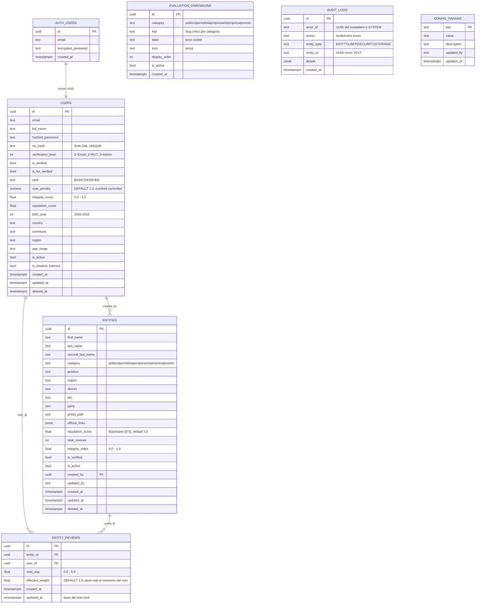

# Esquema de Base de Datos — BEACON Protocol

> **Baseline generado:** 2026-03-12 (actualizado con migraciones 014 + 015)
> **Para obtener el esquema REAL de Supabase:**
> ```bash
> cd backend
> python scripts/fetch_db_schema.py --direct-url "postgresql://postgres:<pass>@db.<project>.supabase.co:5432/postgres"
> ```
> Este archivo será **sobreescrito** por el script con datos en vivo.

---

## Extensiones PostgreSQL

| Extensión | Descripción |
|-----------|-------------|
| `uuid-ossp` | Generación de UUIDs v4 (`uuid_generate_v4()`) |
| `pg_trgm` | Búsqueda fuzzy por trigramas (autocompletado de entidades) |

---

## Tipos ENUM

### `public.entity_type_enum`

Valores: `PERSON`, `COMPANY`, `EVENT`, `POLL`

> Definido en migration 002 para la super-tabla `entities` (campo `entity_type`).
> **Nota:** El backend usa la columna `category` (TEXT) con CHECK constraint, no este ENUM.
> Verificar en producción cuál está activo realmente.

---

## Diagrama de Relaciones (Mermaid ER)



---

## Schema `public`

---

### Tabla: `public.users`

_Ciudadanos del Protocolo Beacon — Cada fila es un ser humano verificado._

#### Columnas

| # | Columna | Tipo | Nullable | Default | Descripción |
|---|---------|------|----------|---------|-------------|
| 1 | `id` | `UUID` | NOT NULL | `uuid_generate_v4()` | PK — mismo UUID que `auth.users.id` |
| 2 | `email` | `TEXT` | NOT NULL | — | Email único (espejo de `auth.users.email`) |
| 3 | `full_name` | `TEXT` | NOT NULL | — | Nombre completo (migration 001, legado) |
| 4 | `first_name` | `TEXT` | NULL | — | Nombre (schema real usado por el backend) |
| 5 | `last_name` | `TEXT` | NULL | — | Apellido paterno |
| 6 | `hashed_password` | `TEXT` | NULL | — | Contraseña hasheada (mantenida por Supabase Auth) |
| 7 | `rut_hash` | `TEXT` | NULL | — | SHA-256+salt del RUT. NUNCA texto plano. UNIQUE |
| 8 | `verification_level` | `INT` | NULL | `1` | 1=Email, 2=RUT, 3=Admin |
| 9 | `is_verified` | `BOOL` | NULL | `false` | true si completó verificación RUT |
| 10 | `is_rut_verified` | `BOOL` | NULL | `false` | Alias de `is_verified` (schema real) |
| 11 | `rank` | `TEXT` | NULL | `'BASIC'` | `CHECK (rank IN ('BASIC','VERIFIED'))` — migración 014 |
| 12 | `integrity_score` | `FLOAT` | NULL | `0.5` | `CHECK (0.0 <= integrity_score <= 1.0)` |
| 13 | `reputation_score` | `FLOAT` | NULL | `0.0` | Score propio del usuario |
| 14 | `role` | `TEXT` | NULL | `'user'` | `'user'` o `'admin'` |
| 15 | `country` | `TEXT` | NULL | — | País (ej: "Chile") |
| 16 | `commune` | `TEXT` | NULL | — | Comuna (ej: "Providencia") |
| 17 | `region` | `TEXT` | NULL | — | Región (ej: "Metropolitana") |
| 18 | `age_range` | `TEXT` | NULL | — | Rango etario (ej: "25-34") |
| 19 | `birth_year` | `INT` | NULL | — | Año de nacimiento (1920–2010) — migración 014 |
| 20 | `vote_penalty` | `NUMERIC` | NULL | `1.0` | Multiplicador Overlord: `effective_weight = rank_weight × vote_penalty` — migración 014 |
| 21 | `is_active` | `BOOL` | NULL | `true` | Soft delete |
| 20 | `is_shadow_banned` | `BOOL` | NULL | `false` | Purgatorio invisible |
| 21 | `created_at` | `TIMESTAMPTZ` | NULL | `now()` | — |
| 22 | `updated_at` | `TIMESTAMPTZ` | NULL | `now()` | — |
| 23 | `deleted_at` | `TIMESTAMPTZ` | NULL | — | Fecha de soft delete |

> **Deuda técnica:** Duplicidad `full_name` (migration 001) vs `first_name`+`last_name` (schema real). Los endpoints del backend leen `first_name` y `last_name`. La columna `full_name` puede estar vacía en producción.

#### Constraints

| Tipo | Nombre | Columnas | Referencias |
|------|--------|----------|-------------|
| PRIMARY KEY | `users_pkey` | `id` | — |
| UNIQUE | `users_email_key` | `email` | — |
| UNIQUE | `users_rut_hash_key` | `rut_hash` | — |
| CHECK | `users_rank_check` | `rank` | `IN ('BASIC','VERIFIED')` — migración 014+015 |
| CHECK | `users_integrity_score_check` | `integrity_score` | `>= 0.0 AND <= 1.0` |

#### Índices

| Nombre | Columnas |
|--------|----------|
| `idx_users_email` | `email` |
| `idx_users_rut_hash` | `rut_hash` |
| `idx_users_rank` | `rank` |
| `idx_users_commune` | `commune` |
| `idx_users_is_active` | `is_active` |

#### Políticas RLS

| Política | Comando | USING |
|----------|---------|-------|
| `users_select_own` | SELECT | `auth.uid()::TEXT = id::TEXT` |

> **Brecha:** No hay política SELECT para admins (`role='admin'`). El endpoint `/admin/stats` usa `service_role` que bypasa RLS.

---

### Tabla: `public.audit_logs`

_Bitácora inmutable — Lo que entra al log, nunca sale._

#### Columnas

| # | Columna | Tipo | Nullable | Default | Descripción |
|---|---------|------|----------|---------|-------------|
| 1 | `id` | `UUID` | NOT NULL | `gen_random_uuid()` | PK — migration 011 cambió de BIGSERIAL a UUID |
| 2 | `actor_id` | `TEXT` | NOT NULL | `'SYSTEM'` | UUID del ciudadano o literal `'SYSTEM'` |
| 3 | `action` | `TEXT` | NOT NULL | — | Tipo de acción (ver catálogo en apis.md) |
| 4 | `entity_type` | `TEXT` | NOT NULL | `''` | `ENTITY`, `USER`, `SECURITY`, `STORAGE` |
| 5 | `entity_id` | `TEXT` | NOT NULL | `''` | UUID de la entidad afectada (como TEXT) |
| 6 | `details` | `JSONB` | NOT NULL | `'{}'` | Metadatos específicos de cada acción |
| 7 | `created_at` | `TIMESTAMPTZ` | NOT NULL | `NOW()` | Timestamp de inserción |

> **Deuda técnica:** Migration 001 define `id BIGSERIAL`. Migration 011 redefine como `UUID`. Estado real en producción depende del orden de ejecución de migraciones. Si el BIGSERIAL está activo, el endpoint de audit-logs (que usa `select("*")`) puede retornar IDs numéricos en vez de UUIDs.

#### Constraints

| Tipo | Nombre | Columnas |
|------|--------|----------|
| PRIMARY KEY | `audit_logs_pkey` | `id` |

#### Índices

| Nombre | Columnas |
|--------|----------|
| `idx_audit_logs_created_at` | `created_at DESC` |
| `idx_audit_logs_action` | `action` |
| `idx_audit_logs_actor_id` | `actor_id` |
| `idx_audit_logs_entity_type` | `entity_type` |
| `idx_audit_actor` | `actor_id` (migration 001) |
| `idx_audit_action` | `action` (migration 001) |
| `idx_audit_created` | `created_at` (migration 001) |
| `idx_audit_entity` | `(entity_type, entity_id)` (migration 001) |

> **Deuda:** Índices duplicados entre migration 001 y 011. `IF NOT EXISTS` evita errores pero hay redundancia.

#### Políticas RLS

| Política | Comando | Descripción |
|----------|---------|-------------|
| `audit_insert_service` | INSERT | `WITH CHECK (true)` — cualquier service_role puede insertar |
| `audit_no_delete` | DELETE | `USING (false)` — nadie puede eliminar |
| `audit_no_update` | UPDATE | `USING (false)` — nadie puede modificar |

> Append-only garantizado a nivel de RLS.

---

### Tabla: `public.config_params`

_Panel de control del Overlord — Configuración dinámica del búnker._

#### Columnas

| # | Columna | Tipo | Nullable | Default | Descripción |
|---|---------|------|----------|---------|-------------|
| 1 | `key` | `TEXT` | NOT NULL | — | PK — identificador de la configuración |
| 2 | `value` | `TEXT` | NOT NULL | — | Valor actual |
| 3 | `description` | `TEXT` | NULL | — | Descripción legible |
| 4 | `updated_by` | `TEXT` | NULL | — | UUID del admin que modificó |
| 5 | `updated_at` | `TIMESTAMPTZ` | NULL | `now()` | Timestamp de última modificación |

#### Datos Iniciales (Seed)

| Key | Valor | Descripción |
|-----|-------|-------------|
| `SECURITY_LEVEL` | `GREEN` | Nivel global: GREEN, YELLOW, RED |
| `CAPTCHA_THRESHOLD` | `0.01` | % de requests que reciben CAPTCHA en modo GREEN |
| `VOTE_WEIGHT_BASIC` | `0.5` | Peso de voto rango BASIC — **activo** desde migración 014 |
| `VOTE_WEIGHT_VERIFIED` | `1.0` | Peso de voto rango VERIFIED — **activo** desde migración 014 |
| `VOTE_EDIT_LOCK_DAYS` | `30` | Días hasta poder modificar un voto — **activo** desde migración 014 |
| `DECAY_HALF_LIFE_DAYS` | `180` | Vida media del decaimiento temporal — **pendiente v4.0** |
| `PROBATION_DAYS` | `30` | Días de cuarentena para cuentas nuevas — **no implementado** |
| `MAX_VOTES_PER_HOUR` | `20` | Máximo votos/hora/usuario — **no implementado** |
| `SHADOW_BAN_THRESHOLD` | `0.2` | integrity_score mínimo — **no implementado** |

> **Migración 014:** Eliminados `VOTE_WEIGHT_BRONZE/SILVER/GOLD/DIAMOND`. Agregados `VOTE_WEIGHT_BASIC`, `VOTE_WEIGHT_VERIFIED`, `VOTE_EDIT_LOCK_DAYS`. Los 3 nuevos parámetros son consumidos activamente por `votes.py`.

---

### Tabla: `public.entities`

_Super-Tabla multiclase: PERSON, COMPANY, EVENT, POLL. Cada fila es un activo evaluable._

#### Columnas

| # | Columna | Tipo | Nullable | Default | Descripción |
|---|---------|------|----------|---------|-------------|
| 1 | `id` | `UUID` | NOT NULL | `uuid_generate_v4()` | PK |
| 2 | `first_name` | `TEXT` | NULL | — | Nombre o razón social corta |
| 3 | `last_name` | `TEXT` | NULL | — | Apellido paterno |
| 4 | `second_last_name` | `TEXT` | NULL | — | Apellido materno |
| 5 | `category` | `TEXT` | NOT NULL | — | `politico│periodista│empresario│empresa│evento` |
| 6 | `position` | `TEXT` | NULL | — | Cargo actual |
| 7 | `region` | `TEXT` | NULL | — | Región chilena |
| 8 | `district` | `TEXT` | NULL | — | Distrito electoral |
| 9 | `bio` | `TEXT` | NULL | — | Biografía o descripción |
| 10 | `party` | `TEXT` | NULL | — | Partido político (migration 005) |
| 11 | `photo_path` | `TEXT` | NULL | — | Ruta en Supabase Storage |
| 12 | `official_links` | `JSONB` | NULL | `'{}'` | `{"twitter": "...", "email": "..."}` |
| 13 | `reputation_score` | `FLOAT` | NOT NULL | `3.0` | Score Bayesiano [0-5] (migration 009) |
| 14 | `total_reviews` | `INT` | NOT NULL | `0` | Contador de veredictos (migration 009) |
| 15 | `integrity_index` | `FLOAT` | NULL | `0.5` | Índice de transparencia [0.0-1.0] |
| 16 | `is_verified` | `BOOL` | NULL | `false` | Verificado por el Overlord |
| 17 | `is_active` | `BOOL` | NULL | `true` | Soft delete flag |
| 18 | `created_by` | `UUID` | NULL | — | FK → `users.id` ON DELETE SET NULL |
| 19 | `updated_by` | `TEXT` | NULL | — | UUID del admin que modificó |
| 20 | `created_at` | `TIMESTAMPTZ` | NULL | `now()` | — |
| 21 | `updated_at` | `TIMESTAMPTZ` | NULL | `now()` | — |
| 22 | `deleted_at` | `TIMESTAMPTZ` | NULL | — | Fecha de soft delete |

> **Deuda técnica — Schema duality:** Migration 002 define la tabla con `name TEXT NOT NULL UNIQUE` y `metadata JSONB`, pero el backend real usa `first_name`, `last_name`, `category`, `position`, etc. como columnas individuales. Estas columnas NO aparecen en migration 002. Migration 005 solo agrega `party`. Las columnas `first_name`, `last_name`, `second_last_name`, `category`, `position`, `district`, `bio`, `photo_path`, `official_links`, `deleted_at`, `updated_by` fueron agregadas sin migración documentada en el repositorio.

#### Constraints

| Tipo | Columnas | Descripción |
|------|----------|-------------|
| PRIMARY KEY | `id` | — |
| UNIQUE | `name` | (migration 002 — puede haber sido removido) |
| CHECK | `reputation_score` | `>= 0.0 AND <= 5.0` |
| CHECK | `integrity_index` | `>= 0.0 AND <= 1.0` |
| CHECK | `total_reviews` | `>= 0` |
| CHECK | `category` | `IN ('politico','periodista','empresario','empresa','evento')` |
| FOREIGN KEY | `created_by` → `users.id` | ON DELETE SET NULL |

#### Índices

| Nombre | Columnas | Propósito |
|--------|----------|-----------|
| `idx_entities_type` | `entity_type` | Filtros por tipo (migration 002) |
| `idx_entities_name` | `name` | Búsqueda exacta (migration 002) |
| `idx_entities_name_trgm` | `name gin_trgm_ops` | Fuzzy search trigramas |
| `idx_entities_commune` | `commune` | Filtro territorial |
| `idx_entities_is_active` | `is_active` | Filtro entidades activas |
| `idx_entities_service_tags` | `service_tags` GIN | Multi-servicio holdings |
| `idx_entities_reputation` | `reputation_score DESC` | Ranking |
| `idx_entities_integrity` | `integrity_index DESC` | Ranking por integridad |
| `idx_entities_created_by` | `created_by` | Trazabilidad forense |
| `idx_entities_reputation_score` | `reputation_score DESC` | Migration 009 (duplicado) |

#### Políticas RLS

| Política | Comando | Condición |
|----------|---------|-----------|
| `entities_public_read` | SELECT | `is_active = true` |
| `entities_insert_verified` | INSERT | Auth + rank IN ('SILVER','GOLD','DIAMOND') + `is_verified=false` |
| `entities_update_service` | UPDATE | `USING (true)` — solo service_role efectivamente |
| `entities_no_delete` | DELETE | `USING (false)` — prohibido |

#### Triggers

| Nombre | Evento | Timing | Función |
|--------|--------|--------|---------|
| `trg_audit_entity_creation` | INSERT | AFTER | `fn_audit_entity_creation()` → inserta en `audit_logs` |
| `trg_entities_updated_at` | UPDATE | BEFORE | `fn_entities_updated_at()` → actualiza `updated_at` |

---

### Tabla: `public.entity_reviews`

_Registro de veredictos emitidos por ciudadano. UNIQUE(entity_id, user_id) garantiza un voto por par. Anti-brigada._

#### Columnas

| # | Columna | Tipo | Nullable | Default | Descripción |
|---|---------|------|----------|---------|-------------|
| 1 | `id` | `UUID` | NOT NULL | `gen_random_uuid()` | PK |
| 2 | `entity_id` | `UUID` | NOT NULL | — | FK → `entities.id` ON DELETE CASCADE |
| 3 | `user_id` | `UUID` | NOT NULL | — | FK → `users.id` ON DELETE CASCADE |
| 4 | `vote_avg` | `FLOAT` | NOT NULL | — | Promedio de las dimensiones evaluadas `[0-5]` |
| 5 | `effective_weight` | `FLOAT` | NOT NULL | `1.0` | Peso efectivo al momento del voto (`rank_weight × vote_penalty`) — migración 014 |
| 6 | `created_at` | `TIMESTAMPTZ` | NOT NULL | `NOW()` | — |
| 7 | `updated_at` | `TIMESTAMPTZ` | NULL | `NOW()` | Base para time-lock de modificación — migración 014 |

> **Nota de diseño:** Solo guarda el `vote_avg` (promedio) y `effective_weight`, NO los scores individuales por dimensión. Los detalles de cada dimensión quedan en `audit_logs.details.scores`. Para análisis granular se requiere consultar audit_logs.

#### Constraints

| Tipo | Nombre | Columnas | Referencias |
|------|--------|----------|-------------|
| PRIMARY KEY | `entity_reviews_pkey` | `id` | — |
| UNIQUE | `entity_reviews_unique_vote` | `(entity_id, user_id)` | Anti-brigada |
| CHECK | — | `vote_avg` | `>= 0 AND <= 5` |
| FOREIGN KEY | — | `entity_id` | `entities.id` ON DELETE CASCADE |
| FOREIGN KEY | — | `user_id` | `users.id` ON DELETE CASCADE |

#### Índices

| Nombre | Columnas |
|--------|----------|
| `idx_entity_reviews_entity_user` | `(entity_id, user_id)` |
| `idx_entity_reviews_user` | `user_id` |

#### Políticas RLS

| Política | Comando | USING |
|----------|---------|-------|
| `Users can read own reviews` | SELECT | `auth.uid() = user_id` |

---

### Tabla: `public.evaluation_dimensions`

_Dimensiones de evaluación configurables por categoría. Reemplaza el hardcode del frontend._

#### Columnas

| # | Columna | Tipo | Nullable | Default | Descripción |
|---|---------|------|----------|---------|-------------|
| 1 | `id` | `UUID` | NOT NULL | `gen_random_uuid()` | PK |
| 2 | `category` | `TEXT` | NOT NULL | — | `politico│periodista│empresario│empresa│evento` |
| 3 | `key` | `TEXT` | NOT NULL | — | Slug único por categoría |
| 4 | `label` | `TEXT` | NOT NULL | — | Texto visible al ciudadano |
| 5 | `icon` | `TEXT` | NOT NULL | `'📊'` | Emoji del slider |
| 6 | `display_order` | `INT` | NOT NULL | `0` | Orden de presentación |
| 7 | `is_active` | `BOOL` | NOT NULL | `true` | Activo/inactivo |
| 8 | `created_at` | `TIMESTAMPTZ` | NOT NULL | `NOW()` | — |

#### Constraints

| Tipo | Nombre | Columnas |
|------|--------|----------|
| PRIMARY KEY | `evaluation_dimensions_pkey` | `id` |
| UNIQUE | `uq_dimension_category_key` | `(category, key)` |

#### Índices

| Nombre | Columnas |
|--------|----------|
| `idx_dimensions_category` | `category` |
| `idx_dimensions_active` | `(category, is_active, display_order)` |

#### Políticas RLS

| Política | Comando | Descripción |
|----------|---------|-------------|
| `dimensions_read_public` | SELECT | `USING (true)` — lectura pública |

#### Datos Seed (migration 010)

| Categoría | Key | Label | Ícono |
|-----------|-----|-------|-------|
| politico | transparencia | Transparencia | ⚖️ |
| politico | gestion | Gestión | 📊 |
| politico | coherencia | Coherencia | ✅ |
| periodista | probidad | Probidad | 💎 |
| periodista | confianza | Confianza | 🤝 |
| periodista | influencia | Influencia | ⭐ |
| empresario | probidad | Probidad | 💎 |
| empresario | confianza | Confianza | 🤝 |
| empresario | influencia | Influencia | ⭐ |
| empresa | servicio_cliente | Servicio al Cliente | 🎧 |
| empresa | etica_corporativa | Ética Corporativa | 🏛️ |
| empresa | calidad_producto | Calidad de Producto | ⭐ |
| empresa | transparencia | Transparencia | 🔍 |
| evento | organizacion | Organización | 📋 |
| evento | experiencia | Experiencia | 🎪 |
| evento | seguridad | Seguridad | 🛡️ |

---

## Schemas de Supabase (Auth, Storage)

> Estos schemas son gestionados internamente por Supabase y no están en las migraciones del repo.
> Ejecutar `fetch_db_schema.py --direct-url` para obtener el detalle completo.

### Schema `auth`

| Tabla | Descripción |
|-------|-------------|
| `auth.users` | Usuarios de Supabase Auth. Beacon usa `auth.uid()` para RLS |
| `auth.sessions` | Sesiones activas y tokens JWT |
| `auth.refresh_tokens` | Tokens de refresco |

### Schema `storage`

| Tabla/Bucket | Descripción |
|--------------|-------------|
| `storage.buckets` | Definición de buckets (`imagenes`) |
| `storage.objects` | Objetos almacenados (fotos de entidades) |

Bucket `imagenes`: almacena fotos de entidades bajo el path `entities/{uuid}.{ext}`.

---

## Brechas de Migración Documentadas

| # | Brecha | Impacto | Referencia |
|---|--------|---------|------------|
| 1 | Columnas `first_name`, `last_name`, `category`, `position`, `district`, `bio`, `photo_path`, `official_links`, `deleted_at`, `updated_by` en `entities` no aparecen en ninguna migración del repo | ALTA — el schema real de producción diverge de lo documentado | migrations/002, 005 |
| 2 | Columnas `first_name`, `last_name`, `role`, `is_rut_verified`, `age_range` en `users` no están en migration 001 | ALTA — misma causa | migrations/001, 004 |
| 3 | Migration 001 usa `audit_logs.id BIGSERIAL`; migration 011 redefine como `UUID` | MEDIA — riesgo de inconsistencia si las migraciones se aplicaron parcialmente | migrations/001, 011 |
| 4 | `entity_type_enum` definido en migration 002 pero el backend usa `category TEXT` con CHECK | BAJA — el ENUM puede estar en la BBDD sin ser usado | migrations/002 |
| 5 | Índices duplicados en `entities` (migration 002 y 009 crean índices similares en `reputation_score`) | BAJA — `IF NOT EXISTS` previene error pero hay redundancia | migrations/002, 009 |

---

## Resumen

| Métrica | Valor |
|---------|-------|
| Schemas documentados | 3 (`public`, `auth`, `storage`) |
| Tablas en `public` | 6 |
| Tablas en `auth` (Supabase) | ~15 (gestionadas internamente) |
| Columnas en `public` | ~70 |
| Constraints | ~25 |
| Índices en `public` | ~25 |
| Políticas RLS | ~10 |
| Triggers | 2 |
| Funciones | 2 (`fn_audit_entity_creation`, `fn_entities_updated_at`) |
| Extensiones | 2 (`uuid-ossp`, `pg_trgm`) |
| Enums | 1 (`entity_type_enum`) |
